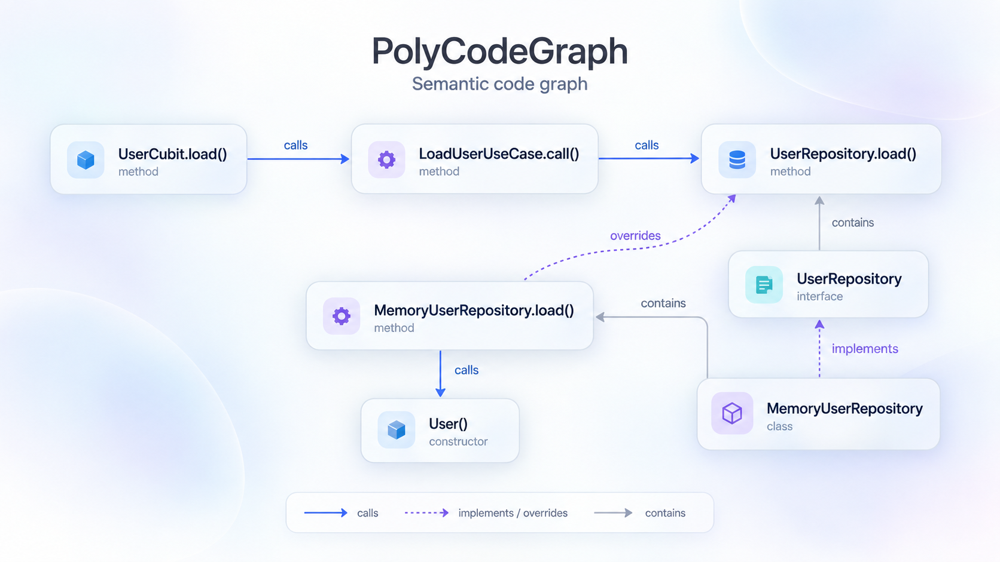

# PolyCodeGraph

Semantic code intelligence for **Dart/Flutter, TypeScript, JavaScript, Java, Go, Python, Rust, Swift, Objective-C and Kotlin**, exposed through a compact **Model Context Protocol (MCP)** server for coding agents and AI harnesses.

Index a repository, explore its symbols and dependencies through compact graph queries, assess the impact of a change, and request only the source snippets you need. Relations use compiler-resolved symbols rather than matching names across files. A mixed repository shares one graph and one MCP API; each language keeps its own semantic resolver.



*Illustrative graph based on the Flutter fixture in this repository. The artwork represents semantic relationships; it is not a screenshot of a graph viewer.*

- **Symbols and relations:** classes, mixins, enums, extensions, typedefs, functions, methods, fields, constructors, imports, references, inheritance and overrides.
- **Agent tools:** symbol search, callers/callees, implementations, neighbors, dependencies, architecture summaries and conservative blast radius.
- **Incremental index:** content hashes, transitive invalidation and a persistent repository-local cache.
- **Optional Flutter discovery:** Widget/Screen, Bloc/Cubit, Riverpod providers, repositories, use cases, routes, GetIt registrations and Freezed annotations.
- **Local workflow:** stdio MCP for Codex/Claude Code, CLI commands, YAML/JSON configuration and an adaptable AGENTS.md harness.

No embeddings, LLM API key or database service is required. The server is a native Rust executable. Additional semantic adapters need their language runtimes; install only the adapters used by your projects.

**Version 0.7.0.** All ten [intent context services](docs/intents.md) are available through `inspect_change`: rename, change_signature, find_tests, review_change, explain_symbol, trace_flow, move_symbol, remove_symbol, replace_dependency and extract_symbol, across all ten languages. See [0.7 migration](docs/migration-0.7.md) and [validation](docs/benchmarks/intents-0.7/report.md).

**Rust core.** Opt-in compact responses, paged diagnostics and per-tool metrics, on the Rust core with local stdio MCP, SQLite cache and filesystem watcher. Dart Analyzer 13.3.0 remains the Dart/Flutter semantic provider.

## Install and run

Download a prebuilt package from [release v0.7.0](https://github.com/RolandDumit/polycodegraph/releases/tag/v0.7.0). **Rust is not required to run these packages.**

| System | Download |
| --- | --- |
| Linux x64 | [tar.gz](https://github.com/RolandDumit/polycodegraph/releases/download/v0.7.0/polycodegraph-0.7.0-linux-x64.tar.gz) |
| Windows x64 | [zip](https://github.com/RolandDumit/polycodegraph/releases/download/v0.7.0/polycodegraph-0.7.0-windows-x64.zip) |
| macOS Intel | [tar.gz](https://github.com/RolandDumit/polycodegraph/releases/download/v0.7.0/polycodegraph-0.7.0-macos-x64.tar.gz) |
| macOS Apple Silicon | [tar.gz](https://github.com/RolandDumit/polycodegraph/releases/download/v0.7.0/polycodegraph-0.7.0-macos-arm64.tar.gz) |

Extract the archive and keep the executable beside its `providers/` directory. Open that folder in a terminal and run `./polycodegraph --version` on Linux/macOS or `.\polycodegraph.exe --version` on Windows. Then use that executable for the setup and serve commands below. The packages include compiled Dart/Go workers and provider source assets; SDKs/runtimes for selected languages remain necessary. [SHA256SUMS](https://github.com/RolandDumit/polycodegraph/releases/download/v0.7.0/SHA256SUMS) verifies the four archives.

To build from source instead:

```sh
git clone https://github.com/RolandDumit/polycodegraph.git
cd polycodegraph
cargo build --release --locked
```

Use `target/release/polycodegraph` on Linux/macOS or `target/release/polycodegraph.exe` on Windows. Rust 1.99.0 is pinned for source builds, which also need GCC/Clang, Xcode CLI tools or Windows MSVC Build Tools for bundled SQLite; end users of native packages do not need Rust. **Non-Dart projects do not need Dart.** Dart/Flutter analysis requires Dart SDK 3.11+ (or Flutter's bundled SDK). Other requirements: Node.js 22+ for TS/JS, full JDK 17+ for Java/Kotlin, Go 1.25+ for Go and Python 3.11+ for Python/Rust/mobile adapters. Swift requires a native Swift 6.2+ toolchain. UIKit analysis requires macOS/Xcode; Android requires a prepared SDK/classpath.

Prepare only selected adapters; without `--languages`, setup discovers languages included in the target project's configuration:

```sh
polycodegraph setup --root /path/to/project --languages dart
polycodegraph setup --root /path/to/project --languages typescript,javascript
polycodegraph setup --root /path/to/project --languages swift,objectivec,kotlin
polycodegraph doctor --root /path/to/project
polycodegraph init --root /path/to/project
polycodegraph index --root /path/to/project
polycodegraph serve --root /path/to/project
```

Replace `polycodegraph` with its executable path until installed on PATH. `setup` builds the Dart/Go adapters and prepares pinned Python, rust-analyzer and Kotlin assets. For nonstandard npm installations set `NPM_CLI` to `npm-cli.js`. `--dev` prepares Ruff/mypy for adapter development. Setup operates on trusted tool assets; indexing never installs target dependencies or executes target build hooks. Resolve those dependencies normally (`flutter pub get`, Node package setup, etc.) before indexing.

Linux x64, Windows x64 and macOS x64/ARM64 package workflows build native artifacts. CI checks the core and real providers on Linux/macOS/Windows. SDK/toolchain requirements and virtual environments are host-specific: recreate adapter environments on a different machine. Set `sdk_path` if Dart SDK discovery is unavailable.

Read [migration from 0.4](docs/migration-0.5.md) when updating an existing harness. The CLI is now Rust; `dart run bin/polycodegraph.dart` and Dart global activation are replaced by the native executable.

### Compact response profile (0.6.0)

Set `response_profile: compact` in YAML/JSON or launch the native executable
with `serve --response-profile compact`. Legacy remains the default; `detail: full` expands an individual
MCP call. `status` and indexing summarize health without dumping runtime paths
and large file lists. Search defaults to 10 rows, relations to 20 and implicit
snippets to 30 lines; explicit limits/windows and pagination remain available.

```json
{"name":"status","arguments":{}}
{"name":"status","arguments":{"section":"diagnostics","offset":0,"limit":20}}
{"name":"status","arguments":{"section":"update","offset":0,"limit":20}}
{"name":"search_symbol","arguments":{"query":"Presenza","file":"packages/domain/","limit":5}}
{"name":"inspect_change","arguments":{"target":"<stable-id>","limit":10}}
{"name":"status","arguments":{"detail":"full"}}
```

Paths are relative to the graph root; nonexistent indexed prefixes produce a
warning and a unique suggestion when possible, never a silent correction.
Check status once, use `inspect_change` before editing and avoid repeating its
sections without a reason. Still scan explicitly before sensitive impact and
after edits. See [profile contract and rollback](docs/response-profiles.md) and
the [consumer harness template](docs/harness-AGENTS.md). Smaller response bytes
do not prove savings in AI tokens or subscription quota; compact stays opt-in
until the controlled token experiment meets its correctness and consumption gates.

### Intent context (0.7)

```json
{"name":"inspect_change","arguments":{"target":"<stable-id>","intent":"rename","options":{"new_name":"recordedAt"},"budget":{"max_chars":12000,"max_items":40,"max_files":12}}}
{"name":"inspect_change","arguments":{"target":"<stable-id>","intent":"find_tests"}}
{"name":"inspect_change","arguments":{"target":"src/service.ts","intent":"review_change","options":{"capture_baseline":true}}}
```

Use returned `next_cursor` with identical arguments, and restart if generation or
health changes. Results share evidence/snippets and report every omission. AST
extraction constraints remain partial; they do not establish a safe refactoring.
[Full options, budgets and baseline lifecycle](docs/intents.md).

## Configuration

`init` creates `polycodegraph.yaml`, and refuses to overwrite an existing config. The loader also accepts `polycodegraph.yml` or `polycodegraph.json`; `--config path` selects an explicit file. Paths and globs are relative to `--root`; `sdk_path` can be absolute.

```yaml
include:
  - "lib/**/*.dart"
  - "bin/**/*.dart"
  - "test/**/*.dart"
  - "**/*.ts"
  - "**/*.tsx"
  - "**/*.js"
  - "**/*.jsx"
  - "**/*.mjs"
  - "**/*.cjs"
  - "**/*.java"
  - "**/*.go"
  - "**/*.py"
  - "**/*.pyi"
  - "**/*.rs"
  - "**/*.swift"
  - "**/*.kt"
  - "**/*.h"
  - "**/*.m"
  - "**/*.mm"
exclude:
  - "**/.git/**"
  - "**/.dart_tool/**"
  - "**/build/**"
  - "**/.polycodegraph/**"
cache: .polycodegraph
watch: true
watch_debounce_ms: 200
reconcile_interval_seconds: 30
flutter: true
max_results: 200
max_snippet_lines: 120
max_snippet_chars: 16000
max_file_bytes: 2097152
# sdk_path: /opt/flutter/bin/cache/dart-sdk
# providers_path: /absolute/path/to/polycodegraph/providers
node_path: node
java_path: java
go_path: go
# python_path: /absolute/path/to/prepared/python  # otherwise the adapter venv
python_search_paths: []  # extra source roots or dependency site-packages
# rust_analyzer_path: /absolute/path/to/rust-analyzer  # otherwise installed binary
rust_cfg: []  # extra cfg values, e.g. 'feature="offline"'
# rust_sysroot_src: /absolute/path/to/rust/library  # optional std/core source tree
swiftc_path: swiftc
# libclang_path: /absolute/path/to/native/libclang  # optional Xcode/native override
mobile_project_path: polycodegraph.mobile.json  # optional read-only module model
java_classpath: []  # paths to dependency JARs or compiled class directories
provider_timeout_seconds: 120
```

Defaults index repository sources for all ten languages, including generated Dart files. Dependency/artifact directories (`node_modules`, `vendor`, `target`, `dist`, `build`, `.build`, `.gradle`, `DerivedData`, `.tools`, `.venv`, `venv`, `__pycache__`, `.mypy_cache`, `.ruff_cache`, `.pytest_cache`, `.tox`, `.nox`) are skipped internally. Includes/excludes are explicit config globs; `.gitignore` is not interpreted. Codegraph's explicit inclusion rules take precedence over analysis_options source exclusions; Analyzer still uses the project's language and diagnostic options. Keeping generated `.g.dart`/`.freezed.dart` files gives the best resolved graph. Excluding them reduces coverage; changes to excluded Dart sources still invalidate the index. `exclude` replaces the configured list; internal `.git`, `.dart_tool`, `build`, and the cache directory are always omitted from source discovery. `.dart_tool/package_config.json` is still tracked for invalidation. Unknown keys and invalid types fail with a useful error.

Symlinks and sources larger than `max_file_bytes` are omitted and reported under `skipped`. Source reads and cache paths are restricted to the configured repository; symlink paths cannot be read through `snippet`. Dependency edges pointing to an omitted source node are dropped and counted in `dropped_edges`. Configure trusted repositories only.

CLI `status` inspects the existing cache and pending edits without rebuilding. MCP `status` refreshes before returning health. `serve` starts immediately and indexes lazily on the first graph query, allowing initialization on large projects.

## Connect Codex

Use the executable's absolute path. In `~/.codex/config.toml` (or your project's trusted `.codex/config.toml`):

```toml
[mcp_servers.polycodegraph]
command = "/absolute/path/to/polycodegraph/target/release/polycodegraph"
args = ["serve", "--root", "/absolute/path/to/flutter-project"]
startup_timeout_sec = 20
tool_timeout_sec = 180
```

Alternatively, register the native executable:

```sh
codex mcp add polycodegraph -- /absolute/path/polycodegraph serve --root /absolute/path/to/project
```

Use `codex mcp list` to verify registration. The executable must be available in the environment that launches Codex. Model and reasoning effort belong to the host agent settings; this MCP server does not select or invoke an LLM.

On Windows, the same Codex configuration uses the `.exe` path (TOML literal strings preserve backslashes):

```toml
[mcp_servers.polycodegraph]
command = 'C:\Projects\polycodegraph\target\release\polycodegraph.exe'
args = ['serve', '--root', 'C:\Projects\My Flutter App']
startup_timeout_sec = 20
tool_timeout_sec = 180
```

## Connect Claude Code

```sh
claude mcp add --transport stdio --scope project polycodegraph -- \
  /absolute/path/to/polycodegraph/target/release/polycodegraph serve \
  --root /absolute/path/to/flutter-project
```

Equivalent `.mcp.json` (on Windows, use `C:/Projects/polycodegraph/target/release/polycodegraph.exe` and your project root):

```json
{
  "mcpServers": {
    "polycodegraph": {
      "type": "stdio",
      "command": "/absolute/path/to/polycodegraph/target/release/polycodegraph",
      "args": ["serve", "--root", "/absolute/path/to/flutter-project"]
    }
  }
}
```

Allow the project server in Claude Code and inspect it with `/mcp`. For large repositories, increase the client's MCP tool timeout as needed.

## Language providers

| Language | Semantic engine | Setup and boundaries |
| --- | --- | --- |
| Dart/Flutter | Dart Analyzer 13.3.0 | Existing package configuration and SDK; optional Flutter discovery |
| TypeScript/TSX | Pinned TypeScript compiler API | Reads the nearest tsconfig/jsconfig; resolves aliases, signatures, imports and inheritance |
| JavaScript/JSX/MJS/CJS | TypeScript compiler API | Supports static ES/CommonJS module relationships where the compiler resolves them; typings improve coverage |
| Java | javac Trees / Elements / Types | JDK 17+; configure dependency JARs/classes with `java_classpath`; overload IDs include erased parameter types |
| Go | go/packages + go/types | Go 1.25+ and prepared module/workspace dependencies; static interface methods and implicit structural implementations |
| Python/PYI | Python AST + pinned Jedi 0.20.0 | Python 3.11+; aliases, typed receivers, classes, constructors, methods, fields, properties, async functions and explicit inheritance |
| Rust | rust-analyzer LSP/HIR | Modules, structs, enums, traits, impl blocks, methods, fields, aliases, constants and statically resolved calls; read-only crate model |
| Swift | Swift 6.2+ semantic JSON AST | Compiler USRs for classes/structs, protocols, enums, extensions, aliases, properties, constructors, functions and calls |
| Objective-C/Objective-C++ | libclang canonical cursors | `.h`, `.m`, `.mm`; selectors, categories, properties, protocols, header imports, overrides and static receiver targets |
| Kotlin | Pinned Kotlin K2 2.3.10 resolved IR | `.kt`; classes, interfaces, objects, data/enum classes, extension/suspend functions, overloads, properties, constructors, calls and overrides |

Go loading is read-only and disables module downloads. Java analysis disables annotation processors and does not emit class files. Maven/Gradle build hooks are not executed; provide their resolved classpath. Missing generated sources, unavailable dependencies, unsupported build constraints and compiler errors reduce coverage and appear in diagnostics. Go uses current GOOS/GOARCH/GOFLAGS/build constraints; excluded sources retain a file node and a diagnostic.

`doctor` reports adapter/runtime presence. MCP `status` includes provider health, diagnostic counts and bounded samples (messages capped at 512 characters with explicit truncation); successful presence checks alone do not prove semantic resolution. If an adapter cannot run or times out, its source files receive `provider_unavailable` diagnostics and file nodes; other languages remain queryable. Installing/fixing an adapter invalidates the cached coverage automatically.

Static call targets are used throughout. Go function variables, Java reflection, JavaScript dynamic property access and arbitrary callback flow remain incomplete. An interface call points to its declared method; `implementations` and blast radius expose related implementations conservatively. Go supports structural interfaces without an explicit implements clause. Cross-language RPC/FFI/runtime calls are not inferred from matching names.

### iOS and Android languages

Prepare mobile adapters with a native Swift 6.2+ toolchain, JDK 17+ and Python 3.11+ installed:

```sh
polycodegraph setup --languages swift,objectivec,kotlin
```

Setup installs SHA-256-pinned libclang wheels, downloads the hash-verified official Kotlin 2.3.10 compiler distribution, and builds this repository's trusted graph plugin. It never runs downloaded shell launchers. The running server does not install tools, invoke Gradle/Xcode/SwiftPM, evaluate `Package.swift` or `.kts`, or load project compiler plugins, KAPT or KSP. Kotlin creates temporary compiler output to obtain resolved IR; it does not execute it. Custom Swift macro plugin paths are not supplied.

The server and portable fixtures work on Linux, macOS and Windows with native toolchains. Swift runtime paths are obtained from the native compiler driver; the default SDK follows `SDKROOT` or the selected macOS SDK. Explicit module SDK/target settings take precedence. **Analyzing UIKit/iOS SDK code requires macOS with Xcode and the corresponding SDK.** Android analysis accepts a prepared `android.jar` and dependency JARs on any host. A bridging header can be passed to Swift's importer; graph calls between Swift and Objective-C, or Kotlin and Java, are currently omitted. Framework/dependency declarations remain external to the repository graph.

Without a model, indexed files form one Swift module and one Kotlin module; Objective-C translation units are parsed separately. For multiple targets or platform SDKs, add repository-relative `polycodegraph.mobile.json` (or configure `mobile_project_path`):

```json
{
  "swift": [{
    "name": "App",
    "files": ["ios/App/*.swift"],
    "sdk": "/path/from/xcrun/iphonesimulator.sdk",
    "target": "arm64-apple-ios17.0-simulator",
    "bridging_header": "ios/App/Bridge.h",
    "import_paths": ["prepared/swift-modules"],
    "framework_paths": ["prepared/frameworks"],
    "defines": ["DEBUG"]
  }],
  "objectivec": [{
    "files": ["ios/App/*.h", "ios/App/*.m", "ios/App/*.mm"],
    "sdk": "/path/from/xcrun/iphonesimulator.sdk",
    "target": "arm64-apple-ios17.0-simulator",
    "include_paths": ["ios/App"],
    "framework_paths": ["prepared/frameworks"],
    "arc": true
  }],
  "kotlin": [{
    "name": "AndroidApp",
    "files": ["android/app/src/main/**/*.kt"],
    "classpath": ["/path/to/Android/Sdk/platforms/android-36/android.jar", "prepared/dependency.jar"]
  }]
}
```

Paths may be absolute or relative to the indexed repository. `files` uses slash-separated, case-sensitive glob patterns; `*` also spans directories. Each source belongs to at most one module; unassigned files retain a coverage diagnostic. When a model exists, each used language needs an entry. Unknown keys and executable/plugin/compiler-argument fields are rejected. Generated module/JAR outputs and target dependencies must be prepared separately; dependencies between configured Swift modules use prepared imports, not automatic builds. Default `.h` discovery treats headers as Objective-C; narrow includes/excludes for mixed C/C++ repositories.

For native Apple libclang, set Objective-C module `resource_dir` to the output of `xcrun clang -print-resource-dir` when builtin headers are needed.

Swift JSON AST is a compiler interface without a guaranteed stable format; runtime fingerprints invalidate cached extraction, and unsupported output fails visibly. Static USRs prevent same-name joins; protocol conformances and class overrides are available, but protocol witness-method mappings and runtime callback dispatch are not expanded. Objective-C uses the compiler's declared selector/receiver targets; `id`, forwarding and swizzling do not recover runtime dispatch. Kotlin uses compiler IR identities and explicit override chains; project plugins/generation and cross-platform `expect/actual` compilation are outside this JVM/Android adapter. Diagnostics expose missing modules, SDKs and compiler errors. Mobile model, Xcode/SwiftPM/Gradle configuration, source, provider and runtime edits invalidate indexing; unchanged external SDK/JAR contents require `index --force`.

### Python and Rust setup and precision

For a project using only these two languages:

```sh
polycodegraph setup --languages python,rust
polycodegraph doctor --root /path/to/project
polycodegraph index --root /path/to/project
```

Python declarations come from the Python AST; references and calls use [Jedi static resolution](https://jedi.readthedocs.io/en/latest/docs/api.html). Repository modules are parsed without importing/executing them. Runtime stdlib and adapter-environment packages are available for inference; use `python_search_paths` for other source roots or project dependency site-packages. Syntax support follows the selected Python runtime. Dynamic/ambiguous callbacks are omitted and counted under `unresolved_calls`. Duck-typed/structural Protocol implementations, monkey-patching and arbitrary decorator/runtime dispatch are not inferred. Explicit bases and resolved overridden methods participate in impact analysis.

Rust uses a [rust-analyzer project model](https://rust-analyzer.github.io/book/non_cargo_based_projects.html) built from indexed Cargo package roots, default local features and indexed path dependencies, including dependency aliases/workspace inheritance. Standalone `.rs` sources can be analyzed as separate crates. `rust_cfg` adds explicit build conditions. External registry/git crates are not downloaded/loaded automatically; they produce coverage diagnostics. To describe prepared external crate sources, provide a root `rust-project.json` with `crates`/`deps`, or set `rust_sysroot_src` for std/core sources. When custom features, targets, generated modules or build environments matter, describe them explicitly in that model; the default manifest reader is intentionally conservative.

[Build scripts and procedural macros](https://rust-analyzer.github.io/book/security.html) are disabled. Cargo, indexed `.cargo/config` wrappers, toolchain overrides, project runnables and proc-macro libraries are not executed. The model discards executable fields. Macro-expanded call graphs remain incomplete and are reported. `implementations` resolves Rust trait impls and overriding methods; calls retain their static HIR targets. Source positions, escaped file URIs, Unicode and Windows CRLF are covered by regression tests.

Edits rebuild the affected Python or Rust language scope; additions/deletions, `pyproject.toml`, requirements/lock files, `Cargo.toml`, `Cargo.lock`, `rust-project.json` and provider/runtime changes invalidate the cache. External dependency/source changes without a changed lock/config require `index --force`.

## MCP tools

All graph queries apply pending watcher events and reconcile when due. `index_repository` explicitly scans source hashes. `detect_changes` reports pending changes without indexing. A fixed root prevents an agent from changing the repository or reading arbitrary paths through tool arguments.

| Tool | Arguments | Purpose |
| --- | --- | --- |
| `index_repository` | `force?` | Refresh; report changed, deleted and reindexed files |
| `status` | none | Fresh graph health, diagnostics and counts |
| `detect_changes` | none | Pending edits and environment changes |
| `get_architecture` | `limit?` | Counts, tags, directories, relationship kinds and hubs |
| `search_symbol` / `search` | `query`, `kind?`, `tag?`, `file?`, `language?` | Case-insensitive substring symbol discovery |
| `callers` | `target` | Resolved incoming call sites |
| `callees` | `target` | Resolved outgoing call sites |
| `references` | `target` | Resolved incoming identifier/type references |
| `implementations` | `target` | Transitive subtypes or overriding members |
| `dependencies` | `target`, `direction?` | File-level directives and cross-file symbol dependencies |
| `neighbors` | `target`, `direction?`, `kinds?` | Adjacent graph nodes and source sites |
| `affected_by_change` / `blast_radius` | `target`, `depth?` | Conservative reverse closure, with reasons |
| `inspect_change` | `target`, `depth?`, `limit?`, `include_snippet?` | Symbol, callers, implementations and impact in one generation |
| `snippet` | `target?`, `file?`, `start_line?`, `end_line?`, `context?` | Bounded source window |

List-returning tools accept `offset` (default 0) and `limit` (default 50, capped by `max_results`). `get_architecture` defaults to 20 hubs. `search_symbol.file` is a relative path prefix; `kind`/`tag` are exact filters. Filter `language` with `dart`, `typescript`, `javascript`, `java`, `go`, `python`, `rust`, `swift`, `objectivec` or `kotlin`. An empty `query` lists symbols. Search favors exact names, then prefixes, then substrings. A `target` is a returned stable ID, an unambiguous qualified name/name, or an indexed relative file path. Ambiguous names return candidate IDs instead of guessing.

`direction` is `in`, `out`, or `both`; defaults are `out` for dependencies and `both` for neighbors. `depth` defaults to 6 and supports 1–32. `snippet` needs `target` or `file`; the default window is the symbol's extent (or one line for a file-only request), plus two context lines. Lines are one-based; source is capped by line and character budgets. Inspect `truncated` before assuming you have a complete function.

Examples using the included Dart fixture:

```json
{"name":"get_architecture","arguments":{}}
{"name":"search_symbol","arguments":{"query":"UserRepository","kind":"class"}}
{"name":"callers","arguments":{"target":"lib/domain.dart::UserRepository.fetch#method"}}
{"name":"implementations","arguments":{"target":"UserRepository"}}
{"name":"blast_radius","arguments":{"target":"UserRepository.fetch","depth":12,"limit":20}}
{"name":"neighbors","arguments":{"target":"MemoryRepository","direction":"out","kinds":["extends","with","contains"]}}
{"name":"snippet","arguments":{"target":"LoadUserUseCase.call","context":1}}
```

The protocol returns one text content block containing compact JSON and an equivalent `structuredContent` object for clients that support it. Source is returned only by `snippet`. Tables use a single column header and arrays of rows:

```json
{
  "generation": "<snapshot-hash>",
  "columns": ["id", "kind", "name", "file", "line", "tags"],
  "rows": [["lib/domain.dart::UserRepository#class", "class", "UserRepository", "lib/domain.dart", 3, ["Repository"]]],
  "total": 1,
  "offset": 0,
  "next_offset": null
}
```

Relationship rows add `relation`, `direction`, `site_file`, `site_line` and `confidence`. Call/reference confidence is `resolved`. Impact rows add `distance`, `via` and `reason`. Impact results include `conservative`, `depth_limited`, and `affected_files` for the explored closure. Architecture directories/skipped lists, change-report lists and affected-file summaries are capped at `max_results`, with accompanying `*_total` counts; CLI index reports retain full lists. Page through `next_offset` while the generation remains unchanged; restart pagination if the generation changes. The snapshot hash is deterministic for a fixed root, SDK, configuration and repository state.

## Dart/Flutter accuracy and discovery

Declarations include classes, mixins, enhanced enums/constants, named and unnamed extensions, extension types, typedefs, top-level and named local functions, methods/operators, getters/setters, fields, variables and constructors. Implicit default constructors are represented with `synthetic: true`. Stable IDs use relative source file, qualified name and kind. Editing lines preserves IDs; renaming or moving a symbol changes them. Unnamed extensions/local scopes use source offsets where Analyzer exposes no name, so those IDs may change after preceding edits.

Edges include containment, import/export/part/part-of, extends/implements/with/on constraints, resolved references, calls (including constructors, getters and operators), overriding methods, and recognizable GetIt registrations. Conditional directive alternatives are retained as conservative file dependencies where their URIs resolve.

Calls use Analyzer's **static target**. A call through an interface points to the interface method. `implementations` exposes possible overriding declarations, including abstract members. Impact traversal follows overriding members back to their dispatch contracts, so interface callers are conservatively affected by implementation changes. It also expands members of affected types/files and traverses importers. A depth-limited or diagnostically incomplete graph is not proof that other code is unaffected.

Dynamic receivers, reflection, runtime DI lookup, arbitrary callback flow, anonymous closures, generated code not present on disk, native/plugin dispatch and runtime router behavior cannot be recovered completely. Calls in anonymous closures are attributed to the nearest indexed enclosing declaration. Callback variables do not create guessed call edges. `unresolved_calls`, Analyzer diagnostics, `skipped` and `dropped_edges` expose coverage limits. Only repository symbols are indexed; external SDK/package symbols are not expanded, while imported external URIs remain file dependency nodes.

With `flutter: true`, optional tags include:

| Tag | Recognition |
| --- | --- |
| `Widget` | Resolved Flutter Widget ancestry |
| `Screen` | Widget whose name ends in Screen, Page or View |
| `Bloc` / `Cubit` | Resolved package ancestry |
| `Provider` | Riverpod constructor/ancestry or `@riverpod` annotation |
| `Repository` / `UseCase` | Type name conventions |
| `Route` | Route/Router type names or go_router route construction |
| `GetItRegistration` | Resolved get_it `register*` invocation; typed registrations create `registers` edges |
| `Freezed` | `@freezed` / `@unfreezed` annotation |

Tags are discovery hints. Annotation and naming hints do not certify framework ownership, and no relation is inferred merely from a suffix. Unresolved annotations can still provide hints; diagnostics indicate the incomplete package resolution. This is an API inspired by [Lordymine/codegraph](https://github.com/Lordymine/codegraph), not a drop-in replacement for its schemas.

## Cache and incremental indexing

The repository-local SQLite cache stores schema-3 records, symbols, edges, scopes, dependencies and diagnostics. Transactions publish a coherent generation. Incoming/outgoing indexes and an immutable in-memory graph are reused while the generation is unchanged; unchanged warm queries perform no extraction or graph reconstruction.

`serve` watches the repository before initial indexing. Events are debounced for 200 ms and drained before queries. A complete hash reconciliation runs every 30 seconds, including configured environment/provider/dependency inputs. Lost events can leave a bounded freshness window until reconciliation: inspect `status.freshness`. Watcher errors/overflow force reconciliation; unavailable or disabled watchers scan on every query. `watch: false` restores the strict per-query scanning policy. CLI `index`/`status` perform explicit scans; MCP `index_repository` scans too, and `force: true` reconstructs all records.

Invalidation expands old/new file dependencies and semantic scopes: Dart pubspec contexts, TS/JS configs, Go modules, Rust crates and mobile modules. Java/Python use a conservative root scope. Changed manifest/environment inputs conservatively rebuild the involved language; ambiguous inputs or provider/config changes may rebuild all languages. Record publication is scoped; compiler resolution may still need the full language context, which is sent separately from `emit_files`. This avoids losing links to unchanged declarations. Additions/deletions invalidate their scopes and dependent scopes rather than always rebuilding unrelated modules.

Configured Java/mobile classpaths, mobile include/framework/import paths and bridging headers, Python search paths, explicit Rust source contexts, prepared Node dependency sources and external Dart package source roots participate in reconciliation. Providers/SDK metadata are fingerprinted. For other externally prepared artifacts not tracked directly, explicitly reindex with `force: true` after preparation.

SQLite plus an advisory writer lock serializes publishers. Initial provider failures report incomplete coverage. Failed updates retain the previous committed generation and return an error; resolve the failure before using it for a new change. Source changes during analysis cause retries (up to three). Corrupt/incompatible caches are preserved under a `.corrupt-*` name and rebuilt; old 0.4 JSON caches are left untouched. Keep the cache on a local filesystem and exclude `.polycodegraph/` from Git.

`inspect_change` defaults to depth 6 and 20 rows per section, with explicit omitted/truncated counts; snippets are optional and disabled by default. All sections share a generation. Query output budgets and static-analysis limitations continue to apply.

## Suggested AGENTS.md harness integration

Copy the adaptable instructions from [docs/harness-AGENTS.md](docs/harness-AGENTS.md) into each project's harness. The intended loop is:

1. Read `status`/`get_architecture` and check diagnostics once.
2. Find stable symbol IDs with `search_symbol`.
3. Use `inspect_change` for callers, implementations and impact in one generation; query `dependencies` or individual tools when needed.
4. Read only relevant `snippet` windows, expanding truncated windows explicitly.
5. Make the change, then call `index_repository` and inspect the updated graph.
6. Run the project's normal `dart analyze`/`flutter analyze` and tests; the graph does not replace them.

## Development and validation

See [CONTRIBUTING.md](CONTRIBUTING.md), [AGENTS.md](AGENTS.md) and [VALIDATION.md](VALIDATION.md). Run `cargo xtask check` for format, Clippy and Rust tests; `cargo xtask package` builds a host package. Real-provider MCP validation uses `python tool/smoke.py --group dart|polyglot|mobile|flutter` after provider setup. These tests fail if required coverage is missing.

Differential checks can use `--baseline /path/to/v0.4.0/executable`. They compare all fixture symbols, calls, references, implementations, neighbors, dependencies, impact and snippets while normalizing generation. See [benchmark methodology](docs/benchmarks/README.md); synthetic query results are not token-savings or whole-project analysis claims.

## References

- [Lordymine/codegraph architecture](https://github.com/Lordymine/codegraph/blob/main/docs/ARCHITECTURE.md), the inspiration for compact queries and compiler-backed language adapters. The adapters here are implemented independently.
- [TypeScript compiler API](https://github.com/microsoft/TypeScript/wiki/Using-the-Compiler-API), [Go packages](https://pkg.go.dev/golang.org/x/tools/go/packages), and [javac Trees](https://docs.oracle.com/en/java/javase/25/docs/api/jdk.compiler/com/sun/source/util/Trees.html).
- [Dart Analyzer](https://pub.dev/packages/analyzer) and its [context collection API](https://pub.dev/documentation/analyzer/13.3.0/dart_analysis_analysis_context_collection/AnalysisContextCollection-class.html).
- [Jedi API](https://jedi.readthedocs.io/en/latest/docs/api.html), [rust-analyzer project models](https://rust-analyzer.github.io/book/non_cargo_based_projects.html) and [configuration](https://rust-analyzer.github.io/book/configuration.html).
- MCP [stdio transport](https://modelcontextprotocol.io/specification/2025-11-25/basic/transports) and [tools](https://modelcontextprotocol.io/specification/2025-11-25/server/tools).
- [Codex MCP configuration](https://developers.openai.com/codex/mcp/) and [Claude Code MCP](https://code.claude.com/docs/en/mcp).

Released under the [MIT license](LICENSE). No telemetry is implemented by this server.
