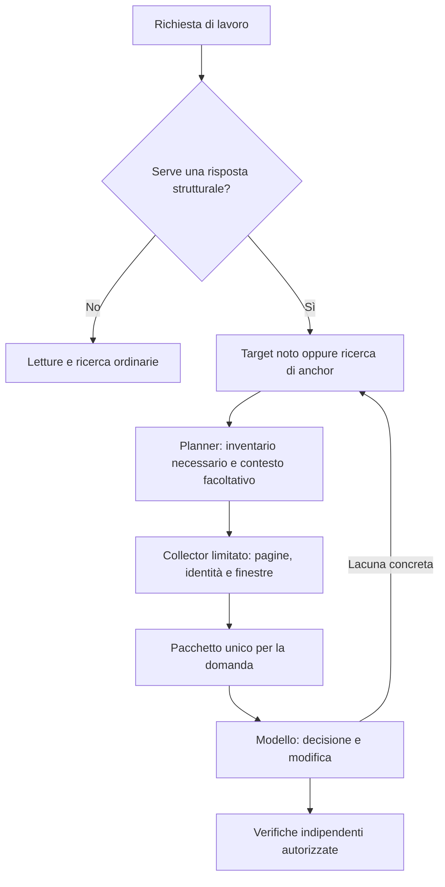

# PolyCodeGraph 0.10.0: ricerca e piano per l'efficienza dei token

Data della ricerca: **7 ottobre 2026**. Stato: **piano di intervento, nessuna modifica al prodotto implementata**.

Versione obiettivo: **0.10.0**. Il piano parte dall'analisi della **0.9.0 già pubblicata**.

Versione analizzata: release GitHub [v0.9.0][release], commit `f1e0484cb1ac66f0fe623fc6e8c4531a886b0a07`. Il checkout locale coincide con questo commit. La release è stata pubblicata il 7 ottobre 2026 alle 08:19:47 UTC.

## 1. Decisione proposta

**Il prossimo investimento deve ridurre il lavoro che l'agente svolge per ottenere e consumare le evidenze, prima di aumentare le capacità del grafo.** La direzione consigliata è un grafo interrogabile selettivamente, con elaborazione deterministica nel server/client e un risultato breve costruito per la domanda corrente.

Questo significa:

1. Per una modifica locale già identificata, consentire davvero il percorso senza grafo: anche senza schemi e istruzioni del grafo nel contesto iniziale, quando il client lo permette.
2. Per una domanda strutturale, recuperare l'inventario necessario e consegnarlo con il minor numero possibile di turni del modello.
3. Separare l'inventario completo dei siti dal codice sorgente utile per decidere o modificare; comprimere la rappresentazione senza perdere evidenze.
4. Migliorare la ricerca dei punti di ingresso, prima di aggiungere embeddings, riassunti generati o altri agenti.
5. Misurare i token dell'intera attività riuscita, incluse pagine, espansioni, schemi, errori, riletture e tentativi falliti.

La ricerca **non dimostra che i grafi siano sempre inutili con i modelli attuali**. Dimostra che migliorare la localizzazione o la qualità del contesto non implica automaticamente ridurre il consumo complessivo. Il benchmark storico di questo repository sostiene la preoccupazione dell'utente, ma non misura ancora la 0.9.0.

**Non proporre una riscrittura in Neo4j, un nuovo sistema GraphRAG generativo o un modello neurale del grafo come prima risposta al problema.** Conservare il core Rust, SQLite, i resolver e le API compatibili; intervenire prima su esposizione, raccolta, selezione e misurazione.

## 2. Perimetro, metodo e forza delle evidenze

La ricerca ha coperto quattro aree:

- Grafi statici del programma: AST, call/reference graph, dipendenze, code property graph.
- Retrieval di codice per modelli e agenti: ricerca selettiva, espansione del grafo, reranking, slicing.
- Compressione e gestione del contesto: deduplicazione, rappresentazioni relazionali, pruning, gestione della cronologia.
- Integrazione con strumenti: schemi MCP, raccolta fuori dal modello, esposizione progressiva e contabilità del client.

Sono state privilegiate fonti primarie: articoli degli autori, proceedings ACL/OpenReview, arXiv, specifiche MCP e documentazione dei produttori. Le fonti del 2026 più recenti sono indicate come preprint; non sono presentate come risultati riprodotti indipendentemente. Per gli studi centrali sono state consultate metodologia, tabelle, ablation e limitazioni, oltre all'abstract. Per i lavori complementari, una consultazione dell'abstract è indicata esplicitamente.

L'analisi del prodotto comprende i documenti di architettura/protocollo/intents e il percorso Rust da richiesta a pianificazione, rendering, proiezione lean e trasporto MCP; comprende inoltre il client Python e i benchmark esistenti. Non è un audit completo di ogni resolver.

Distinzioni da mantenere in ogni decisione:

| Tipo di evidenza | Cosa permette di concludere | Cosa non permette di concludere |
| --- | --- | --- |
| Lettura del codice 0.9.0 | Comportamento implementato, duplicazioni possibili, limiti e punti di intervento | Effetto causale sui token di un modello |
| Replay deterministico | Equivalenza delle evidenze, volume delle risposte, numero di pagine | Risparmio reale di una sessione AI |
| Esperimento con usage del provider | Consumo dell'attività per quella configurazione | Attribuzione a un singolo componente senza ablation |
| Paper su code completion | Utilità nel completamento e nel benchmark studiato | Utilità in rename/review/debugging con un agente moderno |
| Paper su knowledge graph testuali | Tecniche di selezione e rappresentazione trasferibili | Precisione dei riferimenti del compilatore |
| Paper con modello addestrato o accesso ai suoi hidden states | Possibilità con quel runtime e quei pesi | Funzionalità disponibile automaticamente tramite API di un modello chiuso |

Un grafo semanticamente risolto e un indice di similarità semantica sono strumenti diversi. Il primo certifica, entro i limiti del provider, quale simbolo è referenziato. Il secondo suggerisce contenuti probabilmente pertinenti. Il punteggio di retrieval non deve diventare confidence di un arco.

## 3. Che cosa dicono già i dati di PolyCodeGraph

### 3.1 L'esperimento AI disponibile non è un benchmark della 0.9.0

Il [pilot applicativo del 6 ottobre][D1] confronta:

- **A:** nessun MCP, schema o istruzione del grafo.
- **B:** v0.7.0 esatta, risposte compact, 16 strumenti e harness originale.
- **C:** candidato congelato **0.8.0-rc.1**, compact/agent, cinque strumenti e nuove istruzioni.

Modello: gpt-6.1-sol, effort high, Codex CLI 0.159.2. Sei classi, una sola replica per cella, 18 esecuzioni accettate. Il cache del prompt è osservato ma non controllato. Il gate di telemetria G2 fallisce: i risultati sono descrittivi, non una prova robusta di risparmio causale.

| Classe | Input non cached A | Input non cached C | C rispetto ad A |
| --- | ---: | ---: | ---: |
| Modifica locale nota | 5.715 | 8.832 | +54,5% |
| Rename ambiguo | 29.320 | 45.421 | +54,9% |
| Firma pubblica | 19.790 | 78.647 | +297,4% |
| Bug descritto da un sintomo | 22.476 | 25.388 | +13,0% |
| Flusso con ramificazioni | 37.768 | 46.262 | +22,5% |
| Review di file grande | 36.764 | 83.438 | +127,0% |

| Misura aggregata | A | B | C |
| --- | ---: | ---: | ---: |
| Input non cached per attività accettata | 25.305,5 | 55.631,7 | 47.998,0 |
| Input totale | 1.010.585 | 3.178.206 | 1.788.788 |
| Output | 19.311 | 30.862 | 29.676 |
| Richieste al modello | 47 | 81 | 58 |
| Chiamate MCP | 0 | 114 | 25 |
| Errori MCP | 0 | 11 | 2 |
| Pagine tramite cursor | 0 | 46 | 6 |

C usa il 13,7% di input non cached in meno di B, ma l'89,7% in più di A. Tutti i task sono accettati: in questo campione non è misurato un vantaggio qualitativo del grafo. Una replica e sei task non permettono di stimare piccoli vantaggi o regressioni di qualità.

Due segnali sono particolarmente utili:

- Il task locale di C non chiama il grafo, ma consuma comunque di più. Questo rende prioritario studiare esposizione e istruzioni iniziali. Non dimostra da solo che gli schemi causino tutta la differenza.
- Firma e review aggiungono lavoro accessorio e recuperi: review non necessaria, ampliamento del budget, baseline iniziale su un percorso errato, chiamata di uno strumento sbagliato nel trace. Questi costi sono già inclusi nel risultato.

Per raggiungere la parità con A partendo dal consumo storico di C servirebbe un taglio del **47,28%**; per arrivare al 20% sotto A servirebbe il **57,82%**. È un calcolo diagnostico sul pilot, non una previsione o una misura della 0.9.0.

### 3.2 La 0.9.0 corregge problemi reali, ma manca la verifica AI

La [release][release] e il [rapporto deterministico post-0.8][D2] documentano miglioramenti già acquisiti:

- Separazione tra siti rilocati e aggiunte/rimozioni semantiche nella review.
- Scope delle baseline rigoroso, errori sui percorsi esclusi o errati, nuovi file ammessi esplicitamente.
- Formato `pcg-lean-1`, con ID completi, siti distinti, confidence e hash del sorgente.
- Collector e observer opzionali nel client Python.

Nel fixture della review, l'inventario passa da 407 record a uno, le pagine da 11 a una; i caratteri JSON passano da 101.474 a 3.683 in audit e a 2.512 in lean. I 100 siti della prova e le relazioni rilocate restano rappresentabili. Sono misure del fixture e della serializzazione, **non token fatturati**.

Un confronto supplementare dello stesso lavoro contiene un risultato sfavorevole: primitive da 6.662 caratteri contro intent da 21.826. Il piano deve conservare anche questi casi, senza scegliere soltanto benchmark favorevoli.

Il [preflight aggiornato del 6 ottobre][D3] ha già corretto l'isolamento delle credenziali dell'executor e verificato gli schemi registrati dal client reale. Ha inoltre verificato che la binding lean inoltri un testo singolo. Non ha invocato il modello: l'inserimento finale nel prompt del provider e l'uso effettivo restano non misurati. Il blocco attuale della campagna è il budget esplicito richiesto dal protocollo esistente; non va descritto come un problema di isolamento ancora irrisolto.

## 4. Risultati della ricerca: cosa trasferire e cosa evitare

### 4.1 Grafi del codice e retrieval strutturale

| Fonte primaria | Contributo rilevante | Limite per questa decisione | Applicazione proposta |
| --- | --- | --- | --- |
| [Code Property Graph, IEEE S&P 2014][R1] | Unisce struttura sintattica, flusso di controllo e dipendenze dei dati per query di vulnerabilità. | Non studia il consumo di un agente AI. PolyCodeGraph non offre automaticamente un CPG completo con dataflow interprocedurale. | Mantenere relazioni tipizzate e limiti precisi; non promettere runtime flow o alias analysis assenti. |
| [GraphCodeBERT, ICLR 2021][R2] | Usa dataflow nell'addestramento di rappresentazioni del codice. | Il vantaggio dipende dall'architettura e dall'addestramento; non è ottenibile inviando un JSON al modello. | Escluderlo dal primo intervento sul consumo del client. |
| [RepoCoder, EMNLP 2023][R3] | Alterna retrieval e generazione per raffinare il contesto del completamento. | Completamento, non task agentici; iterazioni supplementari possono costare più delle letture risparmiate. | Usare espansioni soltanto per una lacuna concreta, senza un ciclo obbligatorio. |
| [DraCo, ACL 2024][R4] | Recupera definizioni e dipendenze usando un context graph guidato da dataflow. | Esperimenti di completamento Python, principalmente con modelli precedenti; non prova risparmi di sessione sui dieci provider. | Restituire contratti e dipendenze utili al target, anziché tutto il suo vicinato. |
| [GraphCoder, versione consultata 2024][R5] | Retrieval per statement, selezione grossolana seguita da ranking strutturale e slicing. | Il miglioramento principale di efficienza riguarda retrieval/storage; la tabella dei token non dimostra meno consumo rispetto a No RAG. | Unità AST e selezione prima del rendering; evitare finestre generiche grandi. |
| [RepoHyper, versione consultata 2024][R6] | Ricerca di seed, espansione con pattern relazionali e reranking. | Pattern e ranking non equivalgono a completezza dei riferimenti; risultato di code completion. | Espansione direzionale e con destinazione per discovery; niente BFS indiscriminata. |
| [RepoGraph, ICLR 2025][R7] | Integrazione di grafi di codice in sistemi che risolvono issue; ablation su profondità e rappresentazione. | Può migliorare successo e aumentare il costo; sintesi generata introduce perdita e chiamate aggiuntive. | Contesto locale selettivo, con inventari obbligatori mantenuti integralmente. |
| [LocAgent, ACL 2025][R8] | Grafo eterogeneo, ricerca BM25 di entità e strumenti mirati di localizzazione. | Il risparmio economico maggiore include un diverso modello fine-tuned. Non è un risparmio di token del grafo a modello fisso. | Ricerca dei seed e diversità delle entità prima dell'espansione. |
| [CodexGraph, NAACL 2025][R9] | Agente che interroga una base a grafo tramite query generate. | Query generate e debugging della query sono ulteriore lavoro del modello; valutazione centrata su Python. | Preferire le query tipizzate già presenti in Rust; non introdurre Cypher come passo obbligatorio. |
| [SaraCoder, preprint 2025][R10] | Deduplicazione e selezione diversificata del contesto mediante similarità e ranking strutturale. | Top-k e similarità non consentono di eliminare siti necessari a un rename; beneficio non trasferibile quantitativamente. | Deduplicare candidati dello stesso anchor e diversificare soltanto il contesto facoltativo. |
| [RepoScope, preprint 2025][R11] | Nell'abstract propone contesto multivista e call-chain-aware. | Consultazione complementare dell'abstract; non usato come prova quantitativa. | Conservare percorsi esplicativi selezionati quando la domanda riguarda una catena. |
| [GraphLocator, preprint 2025][R12] | Nell'abstract distingue sottoproblemi e ipotesi causali per localizzazione. | Le relazioni tra ipotesi sul bug non sono archi certificati dal resolver. | Eventuali ipotesi del modello devono avere provenance separata dalle evidenze statiche. |

Tre letture quantitative cambiano direttamente le priorità:

**GraphCoder.** La tabella 5 riporta, con GPT-3.5, 758,18 token di input per No RAG e 2.666,13 per GraphCoder; RepoCoder arriva a 7.772,52 dopo tre iterazioni. Una struttura migliore può essere più economica di un RAG iterativo e rimanere molto più costosa del percorso senza retrieval. Il paper segnala inoltre differenze contenute tra diverse rappresentazioni RAG con lo stesso template. [Fonte, §6.4][R5]

**RepoGraph.** Nella tabella 4, un vicinato appiattito a un hop contiene 2.310,7 token e risolve il 29,67% dei casi; a due hop arriva a 10.505,3 token e scende al 26,00%. Nella tabella 2, Agentless passa da 42.376 a 47.323 token medi con il grafo. Questo sostiene la selezione, non una promessa generale di risparmio. I token del vicinato e quelli dell'intera attività sono metriche distinte. [Fonte, tabelle 2 e 4][R7]

**LocAgent.** Il costo circa 86% inferiore pubblicizzato dal lavoro è legato anche all'uso di un Qwen fine-tuned al posto di un modello proprietario. Le ablation sostengono il valore della ricerca BM25, mentre ridurre sempre l'espansione a un hop peggiora alcune metriche. La regola corretta è profondità motivata dalla domanda, non profondità uno per ogni intent. [Fonte][R8]

### 4.2 Retrieval selettivo e valutazione della sua utilità

| Fonte primaria | Risultato utile | Trasferimento realistico |
| --- | --- | --- |
| [Repoformer, ICML 2024][R13] | Apprende quando evitare retrieval; il miglioramento fino al 70% riguarda la velocità d'inferenza nel setup studiato. | Prima decisione: serve informazione esterna? Nel nostro caso partire da regole e segnali osservabili, evitando una chiamata aggiuntiva a un modello classificatore. |
| [CodeRAGBench, Findings NAACL 2025][R14] | Valuta retriever e generatori insieme, mostrando che il recupero va giudicato per l'utilità a valle. | Oracle del task e confronto end-to-end, oltre a recall/precision del retrieval. |
| [CodeRAG, EMNLP 2025][R15] | Query e reranking considerano ciò che è utile al generatore, non soltanto similarità astratta. | Reranking legato all'intent e ai contratti richiesti; log-prob o training specifico restano fuori dalla prima fase. |
| [OrcaLoca, preprint 2025][R16] | Organizza azioni di localizzazione per priorità e limita il contesto. | Una coda deterministica di evidenze può evitare ricerche ripetute. Non copiare automaticamente l'architettura con altri agenti o chiamate LLM. |
| [Sufficient Context, versione consultata 2024/2025][R17] | Distingue contesto sufficiente da capacità del modello di usarlo. | Separare inventario recuperato, sufficienza per la decisione e verifica mediante compilatore/test. |
| [Lost in the Middle, TACL 2024][R18] | Studia sensibilità alla posizione dell'informazione in contesti lunghi. | Mettere target, contratti e limiti rilevanti prima del materiale accessorio; verificarlo sul modello corrente. |
| [NoLiMa, preprint 2025][R19] | Mostra difficoltà in recupero da contesto lungo senza forti coincidenze lessicali. | Un contesto capiente non rende gratuito o utile ogni dato aggiuntivo; non trasferire i numeri al coding moderno. |

**Conclusione operativa originale:** la capacità maggiore del modello alza il livello minimo di utilità richiesto al grafo. Il baseline deve avere gli stessi strumenti ordinari di lettura e ricerca, lo stesso modello e le stesse verifiche. Rendere artificialmente debole il baseline senza grafo invaliderebbe la decisione.

### 4.3 Compressione di grafi e contesto: risultati recenti e limiti

| Fonte primaria | Meccanismo | Che cosa misura | Implicazione |
| --- | --- | --- | --- |
| [G-Retriever, lavoro 2024][R20] | Selezione di sottografo mediante prize-collecting Steiner tree; anche componenti neurali addestrate. | QA su grafi testuali, non modifiche di codice. | Prendere il principio utilità/costo per evidenze facoltative. Non forzare connettività o rimuovere siti obbligatori. |
| [GRAG, Findings NAACL 2025][R21] | Retrieval di sottografi e rappresentazioni che combinano testo e struttura. | QA e componenti specifiche del modello. | Il doppio punto di vista non deve duplicare automaticamente il materiale inviato al modello. |
| [Is GraphRAG Needed?, preprint giugno 2026][R22] | Rappresentazione relazionale, deduplicazione e batch di query. | Riduzioni di token del 19–53% in STaRK-Prime, dominio biomedico, Claude 3.7 Sonnet. | Dizionari, deduplicazione e meno round-trip sono trasferibili; i batch più grandi possono peggiorare la risposta finale. |
| [FeatLens, preprint settembre 2026][R23] | Indice di feature offline, seed semantici, grafo locale e scoring deterministico con PageRank. | Contesto e reasoning di retrieval nel code generation, principalmente Python. | Computare selezione nel server; valutare il costo offline separatamente. Non sostituire gli inventari completi con 15 nodi per ogni task. |
| [SWE-Pruner, preprint gennaio 2026][R24] | Classificatore locale addestrato che sceglie linee rilevanti rispetto a un obiettivo. | Nella tabella principale SWE-bench Verified: 23–38% di token in meno, con piccoli cali di successo. | Iniziare con clipping AST deterministico; un pruner appreso è un esperimento successivo, con costo e perdita misurati. |
| [LaMR, preprint maggio 2026][R25] | Nell'abstract distingue rilevanza e supporto necessario alle dipendenze. | Compressione appresa; consultazione complementare dell'abstract. | Il codice che supporta un contratto può essere necessario anche se poco simile alla domanda. |
| [SWE-PrunerPro, preprint luglio 2026][R26] | Compressione attraverso rappresentazioni interne del modello. | Runtime di modelli accessibili agli autori. | Non è una modifica disponibile nel server MCP per un modello chiuso. |
| [The Complexity Trap, preprint/workshop 2025][R27] | Confronta masking delle osservazioni e sintesi della cronologia. | Costi e successo di agenti nel setup sperimentale. | La gestione della cronologia è responsabilità del client; una sintesi LLM non è automaticamente più economica del masking. |
| [Evaluating AGENTS.md, preprint febbraio 2026][R28] | Confronta agenti con e senza file di contesto aggiuntivi. | Istruzioni aggiuntive possono aumentare il costo e non migliorare il successo. | Ridurre la guida del consumer al necessario; non rimuovere le regole reali del repository o le verifiche richieste. |

Due risultati recenti meritano prudenza particolare:

- **FeatLens:** la tabella 4 confronta 13.040,9 token di retrieval reasoning più contesto per CodexGraph con 7.057,4 per FeatLens, cioè −45,9%. Non è una contabilità completa di input/output di una sessione. L'indice offline usa descrizioni e clustering; non è gratuito. Su GPT-5-mini il Pass@1 passa da 56,35% a 55,03%, pur migliorando il riuso delle dipendenze. Il lavoro suggerisce una direzione utile, ma non prova equivalenza qualitativa né risparmio per PolyCodeGraph. [Fonte][R23]
- **Is GraphRAG Needed?:** le appendici mostrano che alcune varianti batch recuperano più dati, riducono turni e peggiorano le metriche finali. Non basta aggregare più richieste in una risposta enorme: bisogna anche selezionare quanto entra nel contesto. La valutazione usa un dataset e un modello, e non verifica tutte le dimensioni della qualità della risposta. [Fonte][R22]

### 4.4 Strumenti, protocolli e pratiche industriali

| Fonte primaria | Pratica utile | Condizione per applicarla |
| --- | --- | --- |
| [Aider repository map][R29] | Mappa sintetica delle definizioni rilevanti con budget e ranking delle dipendenze. | Una mappa di orientamento deve restare opzionale; non prova completezza di rename o risparmio di un'altra integrazione. |
| [Specifica MCP 2025-11-25, Tools][R30] | Supporta contenuto strutturato e compatibilità con testo JSON. | La duplicazione sul trasporto va distinta da ciò che il client inserisce nel prompt; preservare interoperabilità. |
| [Anthropic, Code execution with MCP][R31] | Caricare capacità necessarie e filtrare risultati fuori dal modello. | Il collector deve elaborare dati del protocollo entro limiti, senza eseguire applicazioni indicizzate. |
| [Anthropic, Advanced tool use][R32] | Ricerca degli strumenti e uso programmatico per grandi cataloghi. | Verificare il supporto del client; con cinque strumenti il discovery può costare più di quanto risparmi. |
| [Cloudflare, Code Mode][R33] | Orchestrazione locale e filtraggio di chiamate a strumenti in un ambiente controllato. | Nessuna necessità di cambiare il core PCG; un batch tipizzato e deterministico è sufficiente per la prima fase. |
| [Microsoft GraphRAG, Query overview][R34] | Distingue retrieval locale e sintesi globale da community report. | Le entità estratte da AI e i report generati non sostituiscono relazioni risolte dal compilatore. La sintesi globale è descritta come costosa. |

Le percentuali molto alte pubblicizzate per tool discovery si riferiscono a cataloghi grandi e a client che implementano quelle capacità. Non sono una previsione per lo schema agent di PolyCodeGraph.

Due controesempi metodologici sono direttamente pertinenti:

- L'[esperimento JetBrains su rtk, luglio 2026][R35] confronta attività reali e contabilità del client, invece di stimare token dal diff degli output. Riferisce un aumento di costo mediano del 7,6% a effort basso e nessun risparmio a effort alto, con qualità simile. Gli output comprimibili sono una frazione del contesto; riletture cached e turni aggiuntivi cambiano il risultato. È un benchmark industriale, non un paper peer-reviewed.
- Il [post JetBrains su strumenti IDE, maggio 2026][R36] contiene una correzione: il confronto originario non isolava causalmente gli strumenti, perché il trattamento osservato includeva istruzioni aggiuntive. È un motivo concreto per separare nel nostro esperimento schemi, istruzioni, utilizzo e trasformazione dei risultati.

## 5. Diagnosi del codice 0.9.0

La tabella seguente distingue fatti osservati e ipotesi di costo. Un'ipotesi resta tale finché non viene verificata con usage end-to-end.

| Punto | Evidenza nel codice | Implicazione plausibile | Intervento |
| --- | --- | --- | --- |
| Esposizione iniziale | `advertised_tools` offre full o agent; i default sono full/legacy. [MCP][C1], [config][C2] | Costo anche con zero chiamate, se gli schemi entrano nel contesto | T1 |
| Schema dominante | Catalogo agent: 9.671 caratteri; `inspect_change`: 6.731, cioè 69,6% del totale. [Catalogo][C3] | Togliere altri tool piccoli non basta | T1 |
| Pagina audit poi lean | Il rendering costruisce la risposta audit e la proietta in lean. [Render][C4], [lean][C5] | Overhead CPU possibile; l'audit intermedio non è automaticamente un costo del prompt | T3, misurare runtime separatamente |
| Raggruppamento lean | Gruppi conservano endpoint, file, confidence, phase, sections e reason; i siti restano distinti. [Lean][C5] | Endpoint e stringhe si ripetono tra gruppi e pagine | T2 |
| Collector | `pcg-lean-collection-1` contiene l'array `pages`; non fonde gli envelope o le finestre tra pagine. [Client][C6] | Una sola inserzione può contenere duplicazioni interne | T2 |
| Finestre sorgente | Merge entro una pagina; edit context può includere la dichiarazione intera. Review di dichiarazioni grandi ha già clipping specifico. [Render][C4] | Riletture tra pagine o tra intent e lettura diretta | T2–T3 |
| Budget | Default 12.000 caratteri, 40 record, 12 file; `max_tokens` usa una stima caratteri/4. [Input][C7], [fits][C8] | Non controlla esattamente il costo del modello né gli schemi | T0, T3 |
| Ricerca lessicale | Indice per riga, overlap con IDF; scope applicato dopo costruzione sotto cap globale. [Retrieval][C9] | Candidati ripetitivi e file tardivi non indicizzati | T4 |
| Completezza lean | Unresolved calls o dropped edges globali possono marcare incompleto un inventario locale. [Lean][C5] | Ulteriore lavoro dell'agente per limiti non necessariamente pertinenti | T5, senza nascondere il limite globale |
| Trasporto MCP | Stesso oggetto in `content.text` e `structuredContent`. [MCP][C10] | Più byte sul wire; doppio costo del modello solo se il client inserisce entrambi | T0–T2 |
| Ledger client | Identifica finestre esattamente uguali; osservazione dell'inserimento dipende dall'integrazione. [Client][C6] | Overlap parziale e prompt non osservabile richiedono contabilità distinta | T0–T2 |

### 5.1 Misure statiche riproducibili di questa analisi

Il conteggio del catalogo usa JSON UTF-8 compatto, senza spazi e senza escaping ASCII forzato, con envelope `{"tools":[...]}`:

| Catalogo | Strumenti | Caratteri Unicode | Byte UTF-8 |
| --- | ---: | ---: | ---: |
| Full | 16 | 16.320 | 16.320 |
| Agent | 5 | 9.671 | 9.671 |
| Solo oggetto `inspect_change` | 1 | 6.731 | 6.731 |

Il contenuto contato è ASCII, da cui l'uguaglianza byte/caratteri. Sono dimensioni del catalogo embedded, non token del tokenizer del modello, né prova della serializzazione effettiva di ogni client.

Il server accetta già le primitive nascoste nel profilo agent, ma una descrizione di schema restituita da `status` è semplice dato: il modello non può invocare magicamente uno strumento che il client non ha registrato. Il server dichiara attualmente `listChanged=false`. Un'esposizione dinamica richiede quindi un'integrazione reale, non un cambiamento della sola istruzione.

### 5.2 Ottimizzazioni già presenti: non rifarle

L'implementazione attuale dispone già di:

- Snapshot immutabili condivisi, adiacenze numeriche, query deterministiche e paginazione stabile.
- Planner di intent nel server, senza far concatenare tutte le primitive al modello.
- Indicazione di usare letture dirette per modifiche locali note.
- Formati compact e lean, raggruppamento di siti, separazione required/optional.
- Destinazioni e limiti per trace, clipping AST, trattamento mirato dei grandi blocchi di review.
- Baseline rigorose e distinzione delle relazioni rilocate.
- Acknowledgement esplicito di contesto mantenuto, con hash e invalidazione; lean non accetta questa modalità.
- Limiti del collector e scadenza di cursor/baseline.

Il valore aggiunto del piano è rendere queste capacità efficaci **nel percorso client → modello**, fondere il risultato finale e correggere la selezione dei seed. Una nuova istruzione «usa meno il grafo» da sola non affronta il problema.

## 6. Obiettivo e contratto di misurazione

### 6.1 Metriche del nuovo protocollo

Il protocollo storico resta immutato. Per il nuovo esperimento definire prima delle run:

**Primaria di prodotto:**

`T_accepted = somma(input totale provider + output provider di tutti i tentativi) / attività accettate`

Include input cached e non cached, tutti i turni e ogni tentativo attribuito alla condizione. Se le attività accettate sono zero, la metrica è indefinita: riportare costi e fallimenti, non zero.

**Metriche obbligatorie di supporto:**

- `U_accepted`: input non cached per attività accettata, per continuità con il pilot.
- Input cached, eventuale cache creation e output, normalizzati secondo i contatori del provider senza doppio conteggio.
- Successo/accettazione, gravità degli errori, siti obbligatori mancanti, modifiche fuori scope.
- Richieste al modello, chiamate e pagine MCP, retry, espansioni, errori, letture dirette successive.
- Latenza per task e runtime/memoria di retrieval e raccolta; cold e warm index distinti.
- Costo monetario soltanto con tariffe e ricevute disponibili, separato dal numero di token.

Il reasoning è una sottoclasse dell'output quando il provider lo espone così: non aggiungerlo di nuovo al totale. I contatori sconosciuti sono `null/unknown`, mai zero. I costi operativi di preparazione/coordinamento e campagne invalidate vanno registrati separatamente dai confronti tra condizioni, senza sparire dal rapporto.

### 6.2 Misure locali utili, ma subordinate

Registrare byte del wire, caratteri e tokenizzazione locale dell'effettivo testo inserito, con versione del tokenizer e confine misurato. Se non esiste un tokenizer esatto per il modello/client corrente, chiamare il risultato **stima**.

Distinguere:

- Materiale esterno nuovo inserito.
- Materiale già inserito e ripetuto.
- Materiale reidratato dopo compaction o perdita del contesto.
- Finestre identiche e intervalli parzialmente sovrapposti.
- Dati registrati dal client e dati certamente esposti al modello.

La somma dei token locali dei tool non è il totale di una sessione: la cronologia viene elaborata più volte. Un taglio del 50% di una componente che pesa il 10% può risparmiare, nel migliore scenario semplificato, soltanto il 5%; i turni aggiuntivi possono annullarlo.

### 6.3 Non rendere impossibile ogni conclusione

Servono due livelli di evidenza:

1. **Effetto del prodotto:** usage completo del provider, trattamento realmente applicato, versioni congelate, oracoli indipendenti e confronto accoppiato. Permette di valutare il pacchetto di interventi anche se il prompt interno del provider non è ispezionabile.
2. **Attribuzione del meccanismo:** schemi e istruzioni materializzati per richiesta, trasformazioni, finestre e boundary di inserimento osservati. Permette di attribuire il risparmio a schema, raccolta, deduplicazione o routing.

Non dichiarare passato il vecchio G2 se mancano i suoi requisiti. Non congelare indefinitamente il miglioramento end-to-end perché un client non espone il proprio prompt: registrare precisamente la parte ignota e restringere la conclusione. Questa distinzione va preregistrata, non introdotta dopo un risultato favorevole.

## 7. Architettura dell'intervento

Il grafo persistente rimane completo entro il contratto dei provider. La riduzione riguarda la proiezione della domanda e l'esposizione al modello.

La scelta del primo ramo non deve richiedere una chiamata LLM supplementare. Usare il target già fornito, il tipo di modifica e il bisogno di riferimenti tra file. Se il client non permette esposizione selettiva, dichiarare il costo fisso residuo e misurarlo.

Il pacchetto proposto deve avere:

- Un envelope con identità di root, generation, health/provider environment e ruolo del sorgente.
- Target e fatti necessari alla domanda.
- Dizionari locali di simboli/file/reason quando convenienti; ogni alias rimanda a un ID stabile completo.
- Inventario di relazioni e siti con offset, confidence, phase e provenance preservati.
- Finestre sorgente fuse per identità e intervallo, con hash e range.
- Stato distinto di inventario, contesto facoltativo, sorgenti disponibili e verifiche non eseguite.
- Limiti attivi leggibili, siti ancora da recuperare e continuation utilizzabile se il budget non basta.

L'ordine suggerito è: target → contratti/fatti decisivi → inventario → sorgente pertinente → limiti e continuation. I limiti che impediscono una decisione sicura devono essere immediatamente visibili, senza richiedere l'apertura di un altro documento.

## 8. Piano eseguibile, in ordine di priorità

### T0 — Rendere misurabile il percorso reale

**Priorità:** P0. **Dipendenze:** nessuna. **Esito atteso:** poter falsificare le ipotesi di risparmio.

Interventi:

1. Riutilizzare `efficiency_comparison.py`, `efficiency_usage.py`, `efficiency_client.py` e il preflight esistente, anziché creare un secondo banco di prova.
2. Congelare un baseline 0.9.0 esatto e configurazioni distinte per default distribuito e migliore percorso opzionale agent/compact/lean. Non chiamare quest'ultimo «default 0.9».
3. Registrare, per ogni richiesta osservabile, elenco/schemi degli strumenti, hash delle istruzioni, modalità di binding, raccolta e trasformazione.
4. Correlare tool call, raccolta, singola inserzione client e successiva richiesta al modello. Verificare con una smoke che il modello riceva e usi il trattamento.
5. Estendere il ledger per identificare overlap parziali, mantenendo un tetto di memoria e lo stato di contabilità incompleta.
6. Normalizzare le ricevute cumulative senza contare di nuovo cache/reasoning. Conservare interruzioni e usage parziale come ignoti.
7. Fare replay gratuiti delle traiettorie disponibili per stimare la quota comprimibile e contare richieste accessorie. Non trasformare i replay in «token risparmiati dal provider».

File principali: [client][C6], [runner][C11], [usage][C12], [token usage][C13].

**Accettazione:** zero valori ignoti sostituiti con zero; trattamento osservato al boundary del client; input/output completo del provider nelle smoke concluse; contabilità delle run interrotte esplicita. Un confronto può essere qualificato al livello prodotto del §6.3, anche senza attribuzione fine.

**Rollback:** nessun cambiamento al protocollo del prodotto; la telemetria non deve finire su stdout durante serve né registrare credenziali.

### T1 — Ridurre il costo di disponibilità del grafo

**Priorità:** P0. **Dipendenze:** T0 per le prove AI; le modifiche deterministiche possono iniziare subito.

Interventi:

1. Definire nel client/harness due percorsi espliciti: lavoro locale senza strumenti/instructions PCG registrati, lavoro che richiede il grafo. Non basta «non chiamare» uno strumento già nel prompt.
2. Iniziare con profili statici a inizio task, compatibili con il client reale. Il discovery dinamico è una variante successiva se il client lo supporta davvero.
3. Scomporre o proiettare lo schema ampio di `inspect_change` per workflow. Derivare gli schemi da un contratto canonico, evitando copie divergenti; mantenere tutti i comandi accettati e i profili full/agent.
4. Escludere dallo schema esposto di un workflow parametri/alias di altri workflow. Validazione canonica, tipi ed enum restano rigorosi; nessun «JSON arbitrario» che sposti gli errori sul modello.
5. Confrontare almeno: schema agent attuale, schema ridotto, riduzione delle sole istruzioni, trattamento completo. Prima replay e dimensioni/token locali, poi smoke mirate.
6. Ridurre la guida del consumer a poche regole operative e rimandare i dettagli al workflow effettivamente usato. Conservare le istruzioni reali del repository.
7. Evitare `status`, ricerca del target, `find_tests`, baseline/review accessoria quando un intent ha già risposto alla domanda e non c'è un requisito indipendente.

File principali: [catalogo][C3], [MCP][C1], [config][C2], [harness][D4], binding del client.

**Target ingegneristico iniziale:** almeno dimezzare il volume dello schema del workflow scelto rispetto all'agent corrente, misurando anche la tokenizzazione quando disponibile. È un obiettivo di representation size, non una promessa del 50% di risparmio del task.

**Accettazione:** il percorso locale registra zero strumenti PCG quando tecnicamente possibile; gli intent previsti funzionano senza errori di discovery; i parametri validi hanno lo stesso significato; nessun effetto sui resolver o sulla fingerprint semantica.

**Vincolo:** la CLI 0.9.0 non offre un comando generico di query/intent. Non basare il percorso on-demand su un comando CLI inesistente. Se necessario aggiungere un endpoint tipizzato in una PR separata, con budget e test, oppure mantenere l'integrazione MCP.

**Rollback:** profilo attuale selezionabile; niente cambiamento dei default finché non passano i gate end-to-end.

### T2 — Fondere la collection lean prima di inserirla nel contesto

**Priorità:** P0/P1. **Dipendenze:** T0; indipendente dalla nuova ricerca T4.

Prima implementazione consigliata: client Python, dietro formato/versione opt-in, ad esempio `pcg-lean-collection-2`. Non cambiare silenziosamente `pcg-lean-1` o `collection-1`.

Interventi:

1. Sostituire l'array grezzo di pagine con un envelope unico e sezioni fuse.
2. Internare endpoint/file/reason ripetuti in dizionari della collection. Usare ID completi nel dizionario e riferimenti locali nel corpo. Per risposte piccole scegliere la forma più breve con una regola deterministica.
3. Unire soltanto record semanticamente identici per attributi e provenance; conservare tutti i siti distinti `(file, line, offset)`, la molteplicità prevista dal contratto, confidence, phase e detail handle.
4. Fondere finestre sovrapposte o adiacenti solo con stessa root, generation, file/hash, vista e fase. Se i byte dell'overlap differiscono, invalidare/reiniziare: non scegliere arbitrariamente una copia.
5. Non fondere sorgente before/current, resolver evidence e ipotesi, né simboli omonimi.
6. Preservare o sostituire esplicitamente i detail handle con un mapping recuperabile tramite il contratto: un alias locale non deve essere inviato al server come se fosse uno stable ID.
7. Riportare una volta le invarianti e i limiti comuni; rendere visibili cambiamenti di salute o sorgente. Non omettere un limite perché era stato inviato in una vecchia risposta.
8. Consegnare una sola trasformazione al modello. L'output raw MCP continua a rispettare la compatibilità structured/text.
9. Mantenere max pagine, byte, tempo, memoria, cancellation e stop su required inventory concluso. Il timeout deve essere applicato dalla binding che effettua la chiamata, non soltanto annotato dal collector.
10. Se snapshot/health cambia a metà raccolta, scartare il risultato parziale del vecchio snapshot. Nessuna collection mista.

File principali: [client][C6], proiezione [lean][C5], [render][C4] soltanto se serve provenance aggiuntiva.

**Accettazione deterministica:** normalizzazione del risultato fused equivalente a tutte le pagine originali per evidenze necessarie, siti, confidence, fasi, sorgente e limiti. Nessun sito perso nei fixture di rename; risposte piccole non devono gonfiarsi.

**Accettazione del prodotto:** meno materiale ripetuto effettivamente inserito, senza crescita delle letture correttive o dei turni. Pubblicare anche i casi in cui la collection non conviene.

**Percorso nativo successivo:** se il client ordinario non può installare il collector, valutare raccolta bounded nel server dietro opzione/API versionata. Una chiamata esterna deve eseguire un piano interno tipizzato, non concatenare MCP sullo stesso trasporto. Per inventari troppo grandi resta una continuation esplicita: batching non significa dump illimitato.

### T3 — Separare completezza dei siti e selezione del sorgente

**Priorità:** P1. **Dipendenze:** T2; T0 per validare l'effetto.

Interventi:

1. Definire una policy per intent che distingua inventario, contratti e sorgente per editing. Non applicare un top-k globale alle evidenze necessarie.
2. Per rename: target e tutti i siti risolti in forma compatta; snippet soltanto per ambiguità, wire names o contesto necessario alla modifica.
3. Per firma pubblica: contratti, tutti i consumer/call site obbligatori, argomenti pertinenti e supporto AST; forwarding e test facoltativi entrano soltanto se richiesti o necessari al caso.
4. Per bug: mantenere messaggi, commenti e stringhe rilevanti ai sintomi; poi recuperare contratti e dipendenze dei migliori anchor. Non adottare il taglio generalizzato dei commenti usato da alcuni benchmark di completion.
5. Per trace: percorso richiesto, branch decisivi, destinazione e limiti; contesto laterale selezionato. L'attuale filtraggio per destinazione va preservato.
6. Per review: riutilizzare baseline rigorose, classificazione relocation e clipping hunk/statement già presenti; ottimizzare metadati e ripetizioni prima di un'altra riscrittura del diff.
7. Se l'agente sta per leggere comunque tutto un file per modificarlo, preferire inventario/locations e una lettura diretta. Non inviare prima copie degli stessi blocchi senza utilità verificata.
8. Scegliere contesto facoltativo con utility per intent divisa per costo, penalizzando duplicazioni e hub generici; usare ordine e tie-break stabili.
9. Calibrare budget piccoli, medi e grandi su fixture reali. Il budget di sorgente deve essere distinto dall'inventario. Quando non basta per i required, indicare incompletezza e continuation senza taglio nascosto.
10. Rendere evidente che l'attuale `max_tokens` è una stima. Aggiungere un budget di inserimento del client con tokenizer preciso solo dove supportato, senza fingere che conti tutto il prompt.

File principali: [planner][C14], [required classification][C15], [render][C4], [input][C7].

**Accettazione:** inventari obbligatori invariati; source window utile al task, hash verificati prima dell'emissione; nessun aumento sistematico di riletture. AST mancante continua a produrre unsupported/partial, non un falso contesto preciso.

**Nota algoritmica:** un greedy deterministico sul contesto facoltativo è la prima implementazione. PageRank/PCST/MMR diventano ablation successive soltanto se mostrano utilità. La copertura dei riferimenti obbligatori non è un problema di top-k.

### T4 — Migliorare la ricerca dei seed senza cambiare la semantica

**Priorità:** P1. **Dipendenze:** T0; può procedere dopo T1 senza attendere T3.

Problemi osservati: più righe dello stesso anchor possono saturare il top-k; il cap globale della costruzione precede lo scope della query; il ranking è overlap IDF per riga, non BM25.

Interventi:

1. Raggruppare risultati per anchor prima del top-k: un candidato, pochi match decisivi, numero di match e espansione/paginazione dei dettagli. Conservare una modalità compatibile per i risultati per riga.
2. Applicare scope effettivo alla costruzione pertinente o partizionare l'indice equamente. Cache bounded con identità di snapshot/environment/scope; non aumentare soltanto il cap globale.
3. Rendere esplicite le porzioni non indicizzate. Una query su un file escluso dal cap non deve sembrare una prova negativa.
4. Aggiungere indice invertito e ranking field-aware: nome/qualname, path, firma, testo/doc/errori. Valutare BM25 rispetto all'overlap corrente.
5. Scegliere tra implementazione Rust e SQLite FTS5 soltanto dopo aver verificato disponibilità, compilazione sulle piattaforme e invalidazione. Non introdurre automaticamente dipendenze o migrazioni di storage.
6. Diversificare gli anchor dei candidati facoltativi quando una stessa funzione domina. Non fondere omonimi; confidence del resolver resta separata dal punteggio lessicale.
7. Usare le relazioni semantiche esistenti per un'espansione direzionale corta; fermarsi quando la domanda è soddisfatta. Preservare ordini/paginazione deterministici.
8. Valutare embeddings/hybrid retrieval solo su un set di fallimenti lessicali verificati e held-out. Conteggiare costruzione, aggiornamento, memoria e costo di query; non aggiungere riassunti LLM per ogni simbolo come default.

File principale: [retrieval.rs][C9], con aggiornamenti a query/config/contratti se cambiano i parametri.

**Fixture necessari:** molti match di una sola funzione; error string senza nome di simbolo; file pertinente oltre il vecchio cap; scope piccolo in repository grande; omonimi; hash/source race; Unicode e determinismo della pagina.

**Accettazione:** migliori anchor utili a parità di budget; nessun nuovo arco inventato; scope non penalizzato dall'ordine globale dei file; miglioramento end-to-end nelle classi bug/flow, oppure mantenere il baseline.

### T5 — Esprimere limiti locali senza indebolire health e freshness

**Priorità:** P2. **Dipendenze:** T3; richiede evidenze migliori di copertura.

L'attuale proiezione lean può usare conteggi globali di unresolved calls/dropped edges per marcare incompleta una risposta locale. Non rimuovere questo controllo senza una prova della copertura pertinente.

Interventi:

1. Distinguere salute globale, completezza dell'inventario conosciuto e copertura della domanda.
2. Aggiungere `task_coverage` soltanto quando è derivabile da diagnostiche/capacità del provider e dai file/relazioni effettivamente traversati. Se non è derivabile, conservarla come unknown.
3. Esporre il limite globale una volta nel pacchetto e indicare se la pertinenza al target è nota, esclusa con prova o ignota.
4. Evitare che il client avvii recuperi inutili per un limite che nessuna ulteriore pagina può risolvere; conservare un next action preciso.
5. Preservare invalidazione per root, generation, health, provider environment, source hash e baseline.

**Accettazione:** nessun incomplete trasformato in complete solo per ridurre token; test su errore pertinente, errore altrove, provider mancante e copertura ignota. La granularità locale è un'estensione del contratto, non un'ottimizzazione puramente cosmetica.

### T6 — Retention e cronologia, soltanto dopo i primi gate

**Priorità:** P2/P3. **Dipendenze:** T0–T3.

Interventi:

1. Usare acknowledgement soltanto quando la binding sa quale contenuto il modello conserva.
2. Dopo compaction, nuovo epoch e reidratazione esplicita; nessuna deduzione dalla presenza di una risposta precedente nel log.
3. Valutare masking di vecchie osservazioni rispetto a self-contained collection, misurando anche perdita del prompt cache, output e richieste supplementari.
4. Non introdurre una chiamata LLM di sintesi permanente se una riduzione deterministica basta.
5. Eventuali digest per dependency cone sono ricerca futura: un file fuori dal cone può cambiare import/resolution o health. Non riusare contesto tra generation senza prova e contratto esplicito.

**Accettazione:** risparmio end-to-end dopo compaction e nei task lunghi; zero riuso di codice obsoleto; possibilità di tornare a risposte autocontenute.

## 9. Campagna di verifica con stop progressivi

### 9.1 Prima i test economici e deterministici

Preparare una corpus di richieste ripetibile che includa:

- Rename ambiguo e più siti sulla stessa riga con offset differenti.
- Molti consumer e signature change con forwarding necessario.
- Una dichiarazione grande e molti hunk rilocati senza cambiamento semantico.
- Un intent più costoso delle primitive e una risposta piccola dove i dizionari non convengono.
- Tool schema senza chiamate, collector con più pagine, overlap parziale e lettura diretta duplicata.
- Corpus oltre i cap lessicali, scope ristretto, keyword nei commenti e nei messaggi d'errore.
- Root/health/generation cambiati a metà raccolta, cursor/baseline scaduto e source edit durante analisi.

Misurare separatamente correctness, byte/caratteri/token locali, runtime e memoria. Confrontare inventory normalizzata e sorgente, non soltanto lunghezza JSON.

### 9.2 Condizioni sperimentali

| Condizione | Scopo |
| --- | --- |
| A: senza grafo | Baseline forte, stessi strumenti ordinari, modello, effort, filesystem e oracle; nessuno schema/istruzione PCG |
| B: 0.9.0 default | Descrivere il prodotto distribuito, senza attribuirgli opzioni non abilitate |
| C: 0.9.0 migliore integrazione attuale | Agent/compact/lean e collector attuali, dichiarati esplicitamente |
| D: candidato selettivo | T1 e T2/T3, con routing ed esposizione realmente applicati |

Non eseguire subito una matrice grande a quattro bracci. La prima fase distingue errori di wiring e reale applicazione; poi usa C/D per l'ablation tecnica e A/D per il valore del prodotto.

Schema progressivo suggerito:

1. **Replay e verifiche senza modello:** nessun consumo AI.
2. **Fino a quattro smoke reali:** una per condizione; verificano binding/usage/oracle, non stabiliscono risparmio.
3. **Screening:** dodici task distinti nelle sei famiglie, A e D, una replica: 24 run. Eventuali ablation C/D su pochi task diagnostici hanno un budget separato.
4. **Conferma:** holdout indipendente e repliche; dimensione determinata dalla varianza dello screening e dal margine qualitativo desiderato.
5. **Generalizzazione:** altri modelli/client e lingue soltanto dopo un segnale utile, senza trasformare controlli saltati in coverage.

Lo screening non è abbastanza grande per dimostrare una non-inferiorità di pochi punti percentuali. Per una dichiarazione di qualità generale serve un'analisi di potenza o un intervallo che soddisfi il margine preregistrato.

### 9.3 Identità, budget e oracoli

Prima di una campagna congelare commit, binario, provider/adapters, modello/versione disponibile, effort, client, istruzioni, schemi, config, corpus, oracle, parser e criterio di stop. Bilanciare l'ordine delle condizioni; nessuna correzione del candidato a metà campagna senza nuova identità.

Il piano **non approva spesa o nuove run AI**. Riutilizzare il meccanismo di budget esplicito del runner già predisposto. I limiti devono comprendere numero di run, input non cached e una stima/cap economico, se disponibile. Se il controllo può avvenire soltanto dopo una run, dichiarare il possibile sforamento finale; non definirlo hard cap.

Gli oracoli devono essere indipendenti dal testo della risposta del modello e dallo stesso grafo valutato. Usare fixture controllate e il banco di verifica autorizzato. Questo piano non autorizza l'esecuzione di applicazioni indicizzate, plugin, package script, build hook o code generation. Dove la qualità funzionale non è verificabile entro questi vincoli, riportare precisamente il limite.

Conservare risultati negativi, run fallite e interruzioni. Costi sconosciuti restano sconosciuti. Non scegliere il miglior tentativo di D e confrontarlo con l'unico tentativo di A.

### 9.4 Gate proposti per il rollout

Questi sono target da preregistrare, non risultati già ottenuti:

| Gate | Criterio |
| --- | --- |
| G0: identità e wiring | Versioni congelate, trattamento realmente applicato, nessun accesso a credenziali dal solver |
| G1: correttezza deterministica | 100% dei siti richiesti preservati nei fixture; equivalenza delle primitive e gate rename; nessun falso complete |
| G2: misurazione | Usage completo e boundary client verificato; attribuzione fine qualificata secondo §6.3 |
| G3: valore del prodotto | Target iniziale: almeno 20% meno `T_accepted` di A e nessun aumento di `U_accepted`, con qualità comparabile |
| G4: assenza di regressioni | Task locali vicini al percorso A; nessuna regressione critica di rename/firma; runtime p95 bounded |
| G5: conferma | Effetto sul holdout e intervalli riportati; nessuna generalizzazione alle lingue/client non provati |

Per il task locale, un margine diagnostico iniziale del 5% sui token rispetto ad A è ragionevole, ma non è un vincolo deterministico del singolo tentativo. Riportare varianza e intervalli.

Per qualità, preregistrare un margine piccolo coerente con il rischio del prodotto; non tollerare siti obbligatori persi come compensazione di un risparmio medio. La «qualità invariata» va sostenuta dall'intervallo o dal perimetro controllato degli oracoli.

Riportare sia il rapporto aggregato per attività accettata sia differenze accoppiate per task, mediana, dispersione e intervalli con bootstrap a livello di task/repository. Le repliche dello stesso task non sono task indipendenti.

**Decisione in caso di mancato vantaggio:** se D batte C ma resta peggiore di A, non presentarlo come risparmio rispetto al non usare il grafo. Abilitare il grafo soltanto nelle classi che mostrano un vantaggio verificato, oppure lasciarlo opt-in. Se il beneficio esiste solo in qualità, quantificare separatamente costo e valore.

## 10. Verifiche tecniche e contratti da preservare

L'intervento riguarda inizialmente presentazione/client/retrieval. Non deve alterare l'identità o la risoluzione dei simboli.

Vincoli obbligatori:

- Tutti i dieci provider: Dart/Flutter, TypeScript, JavaScript, Java, Go, Python, Rust, Swift, Objective-C e Kotlin.
- Stable ID completi, siti e offset distinti, confidence, provenance e precision limits visibili.
- Ordine e pagination deterministici; root/health/environment/generation parte dell'identità.
- Separazione di trasporto, storage, filesystem, indexing e query; sharing per ownership; errori tipizzati e concorrenza limitata.
- Nessun lock di stato condiviso mantenuto durante await dei provider.
- Path confinement, symlink rejection e budget dei subprocess.
- Stdout protocol-only in serve; diagnostica su stderr; cancellation, frame/queue limit ed EOF draining.
- Watcher loss/overflow, riconciliazione, pubblicazione transazionale, modifiche al sorgente durante analisi e contesto degli scope invariati.
- Baseline prima della modifica, scope rigoroso, nuovi file espliciti, expiry e nessun confronto implicito con HEAD.
- Nessuna esecuzione del codice applicativo indicizzato, plugin, script, hook o codegen.

Verifiche richieste durante l'implementazione:

1. `cargo xtask check`.
2. Test Python appropriati per collector/observer/runner, con casi di trasformazione e interruzione.
3. `tool/intent_smoke.py` per i gruppi di lingue interessati; primitive differential contro 0.6 e gate deterministico di rename.
4. Native MCP smoke/differential con gli adapter pertinenti quando cambia comportamento semantico/provider.
5. Android e UIKit su macOS per modifiche che incidono sui relativi contratti; se non eseguibili, stato esplicito non verificato.
6. Se si modifica Dart: formatting, analisi statica e test del provider in `providers/dart`, con Analyzer pinned.
7. Aggiornare schema/config/docs/provider contract e benchmark report insieme al comportamento.

I test devono verificare perdita di evidenze, identità, limiti e integrazione reale; evitare test che confermano soltanto la forma della nuova serializzazione.

## 11. Sequenza delle PR e criteri di arresto

| PR | Contenuto concreto | Condizione per proseguire |
| --- | --- | --- |
| 1 | T0: telemetria, receipt normalization, replay e protocollo congelato | Sapere quale componente è osservata e quale resta unknown |
| 2 | T1: esposizione/routing e schema di workflow minimo | Zero overhead PCG nel percorso locale dove supportato; compatibilità provata |
| 3 | T2: collection fused opt-in, dizionari e merge delle finestre | Equivalenza inventory e nessuna perdita di siti |
| 4 | T3: policy del sorgente per intent e budget separati | Meno duplicazioni senza riletture compensative |
| 5 | T4: anchor-first e scope corretto; poi ablation BM25 | Miglioramento dei seed a parità di budget |
| 6 | Campagna A/D e holdout autorizzati | Risparmio dell'intera attività e qualità verificata |
| 7, solo se utile | T5/T6: coverage locale e retention | Beneficio aggiuntivo misurato, invalidazione preservata |

Non stimare ora un risparmio percentuale cumulativo sommando le percentuali delle PR: gli effetti si sovrappongono e possono cambiare il comportamento dell'agente.

Per la prima tranche limitare la superficie a T0, T1 e T2. Non introdurre embeddings, GNN, agenti di reranking, sintesi LLM offline o una nuova base a grafo. Dopo questa tranche decidere con dati reali se T3/T4 abbiano ancora un margine sufficiente.

I criteri di stop fanno parte del piano: una variante che riduce il payload ma aumenta `T_accepted`, perde required sites o richiede più recuperi torna opt-in/sperimentale. Una release non deve dichiarare token risparmiati finché il consumo del provider non è misurato.

## 12. Esecuzione: qui oppure un altro agente?

**Per l'implementazione consiglio un agente con contesto nuovo, guidato da questo piano; mantenerei questa conversazione per le decisioni e la revisione dei risultati.**

Il motivo è operativo: la ricerca è ampia, mentre l'esecutore deve concentrarsi su pochi contratti, sul codice e sui gate della tranche corrente. Un altro agente non è automaticamente più capace; il vantaggio è il contesto di lavoro più piccolo e una separazione chiara tra ipotesi e risultati. Evitare una catena di passaggi o deleghe simultanee prima di stabilizzare il contratto della collection.

Per contenere anche il contesto dell'esecutore, consegnare il brief seguente e indicare come lettura operativa i §§5–11. Il catalogo di ricerca del §4 resta materiale di riferimento da consultare per una decisione specifica, senza copiarlo nelle istruzioni del consumer o in ogni task del benchmark.

È comunque possibile eseguire qui la prima tranche con continuità immediata. In entrambi i casi partire da T0/T1/T2 e lasciare il core semantico invariato. Una revisione indipendente delle evidenze di token e dei siti persi è più utile che raddoppiare gli agenti di implementazione.

### Brief di consegna all'esecutore

> Lavora sul commit/release verificato e leggi questo piano, AGENTS.md, architecture/protocol/intents. Implementa soltanto T0, T1 e T2 come prima tranche, in cambiamenti separati e reversibili. Riutilizza il runner esistente. Non eseguire nuove campagne AI senza il budget esplicito previsto dal protocollo. Non alterare resolver/stable IDs, non eliminare siti necessari e non presumere supporto del client per lazy tool registration. Conserva full/agent, audit/lean e i formati esistenti; aggiungi un formato fused opt-in. Verifica equivalenza inventory, source hash, health/root/generation, timeout e compaction. Registra misure locali come tali, con unknown espliciti. Presenta patch, controlli realmente eseguiti, limitazioni e campagna preregistrata; non dichiarare risparmio end-to-end da byte o caratteri.

Questo documento non crea una nuova chat, non avvia un agente e non autorizza messaggi o spesa.

## 13. Attività svolte per preparare il piano

- Verificati tag remoto, commit locale e metadata della release GitHub 0.9.0.
- Consultate le fonti primarie collegate nelle sezioni di ricerca.
- Letti architettura, protocollo, consumer harness, intents, API decision, migration/efficiency docs, benchmark applicativo, risultati deterministici e preflight aggiornato.
- Analizzato il percorso di query/rendering/lean, catalogo e trasporto MCP, retrieval lessicale, collector/observer e runner.
- Ricontati catalogo full/agent e quota dello schema `inspect_change`; calcolati i gap storici del §3.
- Eseguito **`cargo xtask check`: passato**, usando la toolchain già disponibile. Nessun codice del prodotto modificato.
- Non rieseguiti in questa attività gli smoke dei provider, Android/macOS UIKit, differential e test Dart: non sono coverage nuova di questo piano.
- Nessuna nuova run di modello, benchmark AI o campagna a pagamento eseguita. Il risparmio della 0.9.0 resta non misurato.

Le verifiche della release pubblicata sono evidenza storica separata; la [CI associata alla release][release-ci] non sostituisce la verifica di un candidato futuro.

## 14. Riferimenti

I collegamenti al codice e ai rapporti sono fissati al commit della 0.9.0. Le fonti esterne dinamiche sono state consultate alla data della ricerca.

### Codice e documentazione PolyCodeGraph

- [Release v0.9.0][release].
- [Pilot AI 0.8.0-rc.1][D1].
- [Decisione e risultati deterministici post-0.8][D2].
- [Preflight dell'executor aggiornato][D3].
- [Harness del consumer][D4].
- [Architettura][D5], [protocollo][D6], [intents][D7], [decisione API][D8], [migrazione 0.9][D9].
- [Catalogo MCP][C3], [profili e pubblicazione degli strumenti][C1], [default][C2].
- [Planner][C14], [classificazione required][C15], [budget/input][C7], [rendering][C4], [proiezione lean][C5], [retrieval][C9].
- [Client e collector][C6], [runner][C11], [parser usage][C12], [token usage][C13].

### Studi e fonti primarie

- R1 — Yamaguchi et al., Modeling and Discovering Vulnerabilities with Code Property Graphs, IEEE S&P 2014.
- R2 — Guo et al., GraphCodeBERT, ICLR 2021.
- R3 — Zhang et al., RepoCoder, EMNLP 2023.
- R4 — Cheng et al., Dataflow-Guided Retrieval Augmentation for Repository-Level Code Completion, ACL 2024.
- R5 — GraphCoder, versione arXiv consultata 2024.
- R6 — RepoHyper, versione arXiv consultata 2024.
- R7 — RepoGraph, ICLR 2025.
- R8 — LocAgent, ACL 2025.
- R9 — CodexGraph, NAACL 2025.
- R10–R12 — SaraCoder, RepoScope, GraphLocator, preprint 2025.
- R13 — Repoformer, ICML 2024.
- R14 — CodeRAGBench, Findings NAACL 2025.
- R15 — CodeRAG, EMNLP 2025.
- R16 — OrcaLoca, preprint 2025.
- R17 — Sufficient Context, versione consultata 2024/2025.
- R18 — Lost in the Middle, TACL 2024.
- R19 — NoLiMa, versione arXiv consultata 2025.
- R20 — G-Retriever, lavoro 2024.
- R21 — GRAG, Findings NAACL 2025.
- R22 — Is GraphRAG Needed?, preprint giugno 2026.
- R23 — FeatLens, preprint settembre 2026.
- R24 — SWE-Pruner, preprint gennaio 2026.
- R25 — LaMR, preprint maggio 2026.
- R26 — SWE-PrunerPro, preprint luglio 2026.
- R27 — The Complexity Trap, versione preprint/workshop 2025.
- R28 — Evaluating AGENTS.md, preprint febbraio 2026.
- R29–R36 — Documentazione e studi industriali primari Aider, MCP, Anthropic, Cloudflare, Microsoft e JetBrains, collegati nei punti pertinenti.

[release]: https://github.com/RolandDumit/polycodegraph/releases/tag/v0.9.0
[release-ci]: https://github.com/RolandDumit/polycodegraph/actions/runs/37590830601
[D1]: https://github.com/RolandDumit/polycodegraph/blob/f1e0484cb1ac66f0fe623fc6e8c4531a886b0a07/docs/benchmarks/efficiency-0.8-application/report.md
[D2]: https://github.com/RolandDumit/polycodegraph/blob/f1e0484cb1ac66f0fe623fc6e8c4531a886b0a07/docs/benchmarks/efficiency-post-0.8/decision.md
[D3]: https://github.com/RolandDumit/polycodegraph/blob/f1e0484cb1ac66f0fe623fc6e8c4531a886b0a07/docs/benchmarks/comparison-20261006-01/execution-readiness.md
[D4]: https://github.com/RolandDumit/polycodegraph/blob/f1e0484cb1ac66f0fe623fc6e8c4531a886b0a07/docs/harness-AGENTS.md
[D5]: https://github.com/RolandDumit/polycodegraph/blob/f1e0484cb1ac66f0fe623fc6e8c4531a886b0a07/docs/architecture.md
[D6]: https://github.com/RolandDumit/polycodegraph/blob/f1e0484cb1ac66f0fe623fc6e8c4531a886b0a07/docs/protocol.md
[D7]: https://github.com/RolandDumit/polycodegraph/blob/f1e0484cb1ac66f0fe623fc6e8c4531a886b0a07/docs/intents.md
[D8]: https://github.com/RolandDumit/polycodegraph/blob/f1e0484cb1ac66f0fe623fc6e8c4531a886b0a07/docs/intents-api-decision.md
[D9]: https://github.com/RolandDumit/polycodegraph/blob/f1e0484cb1ac66f0fe623fc6e8c4531a886b0a07/docs/migration-0.9.md
[C1]: https://github.com/RolandDumit/polycodegraph/blob/f1e0484cb1ac66f0fe623fc6e8c4531a886b0a07/crates/core/src/mcp.rs#L22
[C2]: https://github.com/RolandDumit/polycodegraph/blob/f1e0484cb1ac66f0fe623fc6e8c4531a886b0a07/crates/core/src/config.rs#L119
[C3]: https://github.com/RolandDumit/polycodegraph/blob/f1e0484cb1ac66f0fe623fc6e8c4531a886b0a07/crates/core/src/tools.json
[C4]: https://github.com/RolandDumit/polycodegraph/blob/f1e0484cb1ac66f0fe623fc6e8c4531a886b0a07/crates/core/src/intents/render.rs#L32
[C5]: https://github.com/RolandDumit/polycodegraph/blob/f1e0484cb1ac66f0fe623fc6e8c4531a886b0a07/crates/core/src/intents/lean.rs#L54
[C6]: https://github.com/RolandDumit/polycodegraph/blob/f1e0484cb1ac66f0fe623fc6e8c4531a886b0a07/tool/efficiency_client.py
[C7]: https://github.com/RolandDumit/polycodegraph/blob/f1e0484cb1ac66f0fe623fc6e8c4531a886b0a07/crates/core/src/intents/input.rs#L48
[C8]: https://github.com/RolandDumit/polycodegraph/blob/f1e0484cb1ac66f0fe623fc6e8c4531a886b0a07/crates/core/src/intents/render.rs#L491
[C9]: https://github.com/RolandDumit/polycodegraph/blob/f1e0484cb1ac66f0fe623fc6e8c4531a886b0a07/crates/core/src/retrieval.rs
[C10]: https://github.com/RolandDumit/polycodegraph/blob/f1e0484cb1ac66f0fe623fc6e8c4531a886b0a07/crates/core/src/mcp.rs#L224
[C11]: https://github.com/RolandDumit/polycodegraph/blob/f1e0484cb1ac66f0fe623fc6e8c4531a886b0a07/tool/efficiency_comparison.py
[C12]: https://github.com/RolandDumit/polycodegraph/blob/f1e0484cb1ac66f0fe623fc6e8c4531a886b0a07/tool/efficiency_usage.py
[C13]: https://github.com/RolandDumit/polycodegraph/blob/f1e0484cb1ac66f0fe623fc6e8c4531a886b0a07/tool/token_usage.py
[C14]: https://github.com/RolandDumit/polycodegraph/blob/f1e0484cb1ac66f0fe623fc6e8c4531a886b0a07/crates/core/src/intents/planner.rs#L447
[C15]: https://github.com/RolandDumit/polycodegraph/blob/f1e0484cb1ac66f0fe623fc6e8c4531a886b0a07/crates/core/src/intents/mod.rs#L116
[R1]: https://www.ieee-security.org/TC/SP2014/papers/ModelingandDiscoveringVulnerabilitieswithCodePropertyGraphs.pdf
[R2]: https://arxiv.org/abs/2009.08366
[R3]: https://aclanthology.org/2023.emnlp-main.151/
[R4]: https://arxiv.org/html/2405.19782v1
[R5]: https://arxiv.org/html/2406.07003v1
[R6]: https://arxiv.org/html/2403.06095v4
[R7]: https://arxiv.org/html/2410.14684v2
[R8]: https://aclanthology.org/2025.acl-long.426/
[R9]: https://aclanthology.org/2025.naacl-long.7/
[R10]: https://arxiv.org/html/2508.10068v1
[R11]: https://arxiv.org/abs/2507.14791
[R12]: https://arxiv.org/abs/2512.22469
[R13]: https://arxiv.org/html/2403.10059v2
[R14]: https://aclanthology.org/2025.findings-naacl.176/
[R15]: https://aclanthology.org/2025.emnlp-main.1187/
[R16]: https://arxiv.org/html/2502.00350v2
[R17]: https://arxiv.org/abs/2411.06037
[R18]: https://aclanthology.org/2024.tacl-1.9/
[R19]: https://arxiv.org/abs/2502.05167
[R20]: https://arxiv.org/html/2402.07630v3
[R21]: https://aclanthology.org/2025.findings-naacl.232/
[R22]: https://arxiv.org/html/2606.25656v1
[R23]: https://arxiv.org/html/2609.26480v1
[R24]: https://arxiv.org/html/2601.16746v1
[R25]: https://arxiv.org/abs/2605.15315
[R26]: https://arxiv.org/abs/2607.18213
[R27]: https://arxiv.org/abs/2508.21433
[R28]: https://arxiv.org/abs/2602.11988
[R29]: https://aider.chat/docs/repomap.html
[R30]: https://modelcontextprotocol.io/specification/2025-11-25/server/tools
[R31]: https://www.anthropic.com/engineering/code-execution-with-mcp
[R32]: https://www.anthropic.com/engineering/advanced-tool-use
[R33]: https://blog.cloudflare.com/code-mode/
[R34]: https://microsoft.github.io/graphrag/query/overview/
[R35]: https://blog.jetbrains.com/ai/2026/07/rtk-claude-code-token-savings/
[R36]: https://blog.jetbrains.com/ai/2026/05/what-happens-when-you-give-agents-ide-native-seach-tools/
